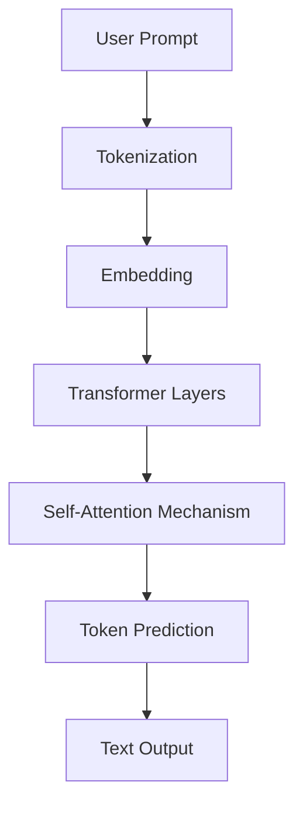

# 01-1-What-is-an-LLM

# What is an LLM?

  

 

A **Large Language Model (LLM)** is an advanced machine learning model trained on vast amounts of text data to understand, generate, and interact using human language. These models are built using transformer architectures and are capable of performing a wide variety of Natural Language Processing (NLP) tasks such as answering questions, writing code, translating languages, summarizing text, and even reasoning.

LLMs are at the core of modern AI applications like ChatGPT, Claude, and Google Gemini, and are transforming how businesses, developers, and users interact with machines using natural language.

---

 <h3><a href="#">What problems do LLMs solve?</a></h3>

  
LLMs help address a range of language-related challenges:

- **Language Understanding**: Enables machines to comprehend and interpret natural language.
- **Text Generation**: Automates content creation across a wide variety of formats.
- **Question Answering**: Powers intelligent search and conversational interfaces.
- **Translation and Summarization**: Improves access to global information and compresses long content.
- **Code Assistance**: Supports software development by writing or explaining code.

---

<h3><a href="#">What are the benefits of LLMs?</a></h3>

Key advantages of using LLMs include:

- **High Versatility**: One model can perform dozens of NLP tasks with minimal tuning.
- **Zero/Few-shot Learning**: LLMs can complete new tasks by simply providing examples in a prompt.
- **Productivity Boost**: Speeds up writing, coding, and content generation.
- **Multilingual Capabilities**: Many LLMs understand and generate text in multiple languages.
- **Human-like Interaction**: Enables more natural communication with machines.

---

<h3><a href="#">How do LLMs work?</a></h3>

LLMs are typically based on the **Transformer architecture**. They are trained on massive text datasets to learn statistical patterns of language. Once trained, they use attention mechanisms to generate context-aware responses based on the user’s prompt. LLMs can be fine-tuned or used via **prompt engineering**, **retrieval-augmented generation (RAG)**, or **agent-based systems** to complete more complex tasks.

<h4> Step-by-step Process </h4>

1. **Input (Prompt)**
   - You provide a question, sentence, or instruction to the model.
   - Example: "Explain what a transformer model is."

2. **Tokenization**
   - The input text is broken down into smaller parts called tokens (words, subwords, or characters).
   - These tokens are converted into numbers (IDs) using a vocabulary.

3. **Embedding**
   - The token IDs are transformed into dense vector representations.
   - This allows the model to understand relationships and meaning in a mathematical space.

4. **Transformer Layers (Attention Mechanism)**
   - The input passes through multiple transformer layers.
   - These layers apply **self-attention** to understand context and relationships between words.

5. **Prediction (Decoding)**
   - The model generates the next token(s) based on the learned patterns.
   - This process continues until it completes the response.

6. **Output (Text)**
   - The output tokens are converted back into human-readable text.

---

### Simple Diagram

---

<h3><a href="#">What are typical use cases for LLMs?</a></h3>

Popular applications of LLMs include:

- **Chatbots and Virtual Assistants**: Automate conversations in customer support or internal tools.
- **Content Creation**: Generate blogs, ads, emails, or documentation at scale.
- **Code Generation**: Write or debug code from natural language descriptions.
- **Search and Retrieval**: Enhance search relevance using semantic understanding.
- **Legal and Financial Analysis**: Extract and summarize information from dense documents.
- **Healthcare Applications**: Summarize medical records or generate reports.

---

<h3><a href="#"> Videos</a></h3>

  

    
  

  

  

    
  

