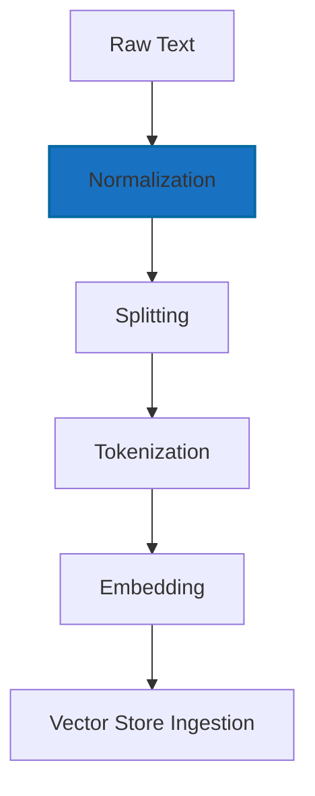
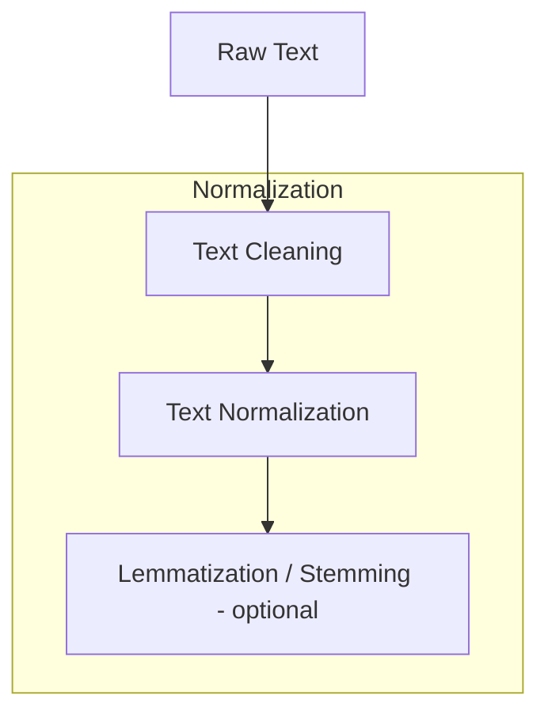

# 02.1. NLP — Processing Language

  <table>
    <tr>
      <td align="center"></td>
      <td align="center"></td>
      <td align="center"></td>
      <td align="center"></td>
    </tr>
  </table>

## 02.1.1. Text Preprocessing / Normalization

### <td align="center"> Introduction

---

Natural Language Processing (NLP) begins with **text preprocessing**, the stage where raw, unstructured text is cleaned and transformed into a consistent format suitable for computational models.

This process ensures that models receive standardized input and can focus on learning semantics rather than handling noise or inconsistencies.

---

### <td align="center"> Why use it?
  
---

Text preprocessing ensures that the input to NLP or LLM systems is:
- **Clean** — free from noise, typos, and irrelevant symbols
- **Consistent** — unified in structure and format
- **Efficient** — reducing unnecessary complexity before vectorization
- **Meaningful** — preserving semantic value while removing redundancy

Without preprocessing, downstream tasks like tokenization, embedding, or model inference can suffer from **data drift**, **inconsistencies**, and **lower accuracy**.

---

### <td align="center"> Components

---

Core components of the text preprocessing pipeline include:

1. **Text Raw** — unprocessed input; may contain punctuation, emojis, typos, and irregular spacing
2. **Normalization** — unify format (lowercasing, normalize whitespace, expand contractions) 
3. **Splitting** — divide text into sentences or segments for structured processing.
3. **Tokenization** — split text into words, subwords, or characters  
4. **Embeddings** — map tokens to dense numerical vectors encoding meaning.
5. **Vectorization** — transform text into numeric representations (TF-IDF, Word2Vec, embeddings)

If we focus on Splitting:

- **Text Cleaning**: remove unwanted elements such as punctuation, HTML tags, URLs, emojis, and other noise that does not contribute to meaning.
- **Text Normalization**: standardize the text by lowercasing, normalizing whitespace, expanding contractions (e.g., don't → do not), and applying consistent formatting rules.
- **Lemmatization / Stemming (optional)**: reduce words to their base or root forms to simplify vocabulary (e.g., running → run). This is optional and more common in classic NLP than in modern LLM pipelines.

---

### <td align="center"> How it works?

---

The pipeline converts raw input into standardized, structured, vectorized data suitable for retrieval or modeling.

Let's go focus on **Normalization** step:

#### Simple Diagram

After receiving Raw Text, the pipeline enters the Normalization step:
1. **Text Cleaning**: remove or fix elements that introduce noise: extra spaces, HTML tags, broken characters, emojis (optional), duplicated lines, and unwanted symbols.
2. **Text Normalization**: 
  - Apply transformations that make the text consistent:
      - lowercasing
      - trimming whitespace
      - standardizing punctuation
      - expanding contractions (e.g., don't → do not)
      - fixing common typos
      - unicode normalization
3. **Lemmatization / Stemming (optional)**:
  - Reduce words to their base form to improve linguistic consistency:
      - **Lemmatization**: reduces words to dictionary form (running → run)
      - **Stemming**: uts words to a root segment (running → runn)

---

### <td align="center"> Use Cases

---

- Preprocessing text for **sentiment analysis**, **topic modeling**, and **text classification**  
- Preparing clean input for **LLM fine-tuning** or **RAG pipelines**  
- Building preprocessing modules for **chatbots** or **voice assistants**  
- Data preparation for **embedding-based retrieval systems** (e.g., ChromaDB, FAISS)

---

###  Limitations

---

- Over-cleaning can **remove important context or meaning**  
- Lemmatization and stemming may **introduce errors** in some languages  
- Handling multilingual text adds **complexity** to preprocessing rules  
- Noise in input data can still propagate if not properly cleaned  

---

###  Code/Notebook/Projects

 - [NLP, NLU, NLG with RAG - Make Matthew notebook from bible](https://github.com/gil-son/llm-engineering-lab/tree/main/notebooks/02-NLP-NLU-NLG)

---

###  Videos

A few recommended resources to visualize:

  

