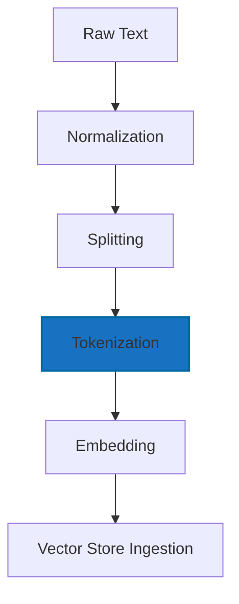
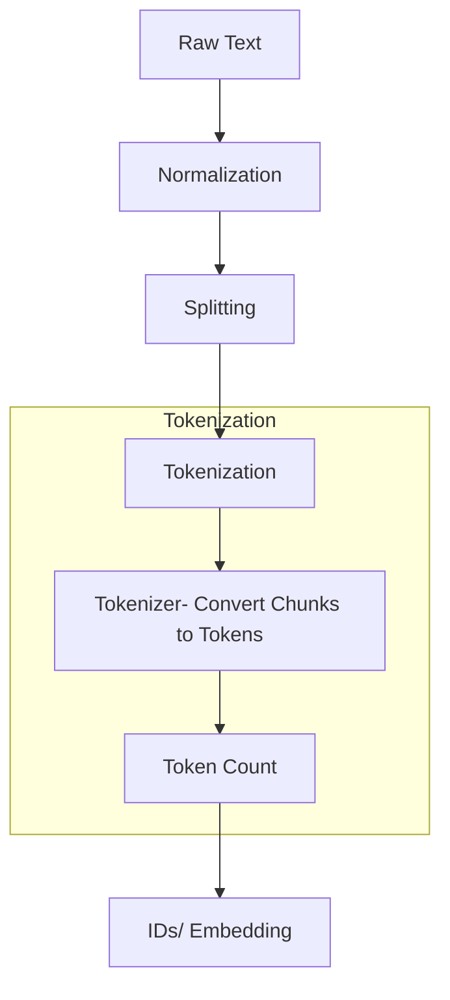

# 02.1. NLP — Processing Language

  <table>
    <tr>
      <td align="center"></td>
      <td align="center"></td>
      <td align="center"></td>
      <td align="center"></td>
    </tr>
  </table>

## 02.1.3. Tokenization

### <td align="center"> Introduction

Tokenization is the process of breaking text into smaller units — called **tokens** — which can be words, subwords, or characters.  
These tokens are the foundation of any Natural Language Processing (NLP) or Large Language Model (LLM) pipeline.

---

### <td align="center"> Why use it?
  
- Models cannot directly understand raw text — they operate on numerical representations.  
- Tokenization creates a **bridge** between human-readable language and machine-readable data.  
- Efficient tokenization improves training and inference speed.

---

### <td align="center"> Components

1. **Text Raw** — unprocessed input; may contain punctuation, emojis, typos, and irregular spacing
2. **Normalization** — unify format (lowercasing, normalize whitespace, expand contractions) 
3. **Splitting** — divide text into sentences or segments for structured processing.
3. **Tokenization** — split text into words, subwords, or characters  
4. **Embeddings** — map tokens to dense numerical vectors encoding meaning.
5. **Vectorization** — transform text into numeric representations (TF-IDF, Word2Vec, embeddings)

If we focus on **Tokenization**:

- **Tokenizer type** (Word, Subword, Character, Byte-Pair Encoding, SentencePiece)
- **Vocabulary** — the set of all tokens the model recognizes
- **Special tokens** (e.g., `[PAD]`, `[CLS]`, `[SEP]`, `<s>`, `</s>`)
- **Token IDs** — numerical identifiers assigned to tokens

---

### <td align="center"> How it works?

The pipeline converts raw input into standardized, structured, vectorized data suitable for retrieval or modeling.

Let's go focus on **Tokenization** step:

#### Simple Diagram

How we see in Splliting step we have Generate Chunks:

**Chuncks:**  ["Neural networks are amazing", "It's because we can improve and create new things"]
   

And start **Tokenization** step:

1. **Tokenizer**: the splitter output (chunks) is fed into the tokenizer, which converts text into tokens.
Modern LLM tokenizers use subword encoding (BPE, WordPiece, SentencePiece).

Example:
"Neural networks are amazing" → ["Ne", "ural", " network", "s", " are", " amazing"]

Subword tokenization ensures:

- Rare words can be represented (e.g., “neurosymbolic” → pieces)
- Vocabulary stays compact
- Better generalization across languages

2. **Token Count:**
    - Counting tokens is essential because:
      - LLMs have a **maximum context window**
      - Costs scale with **number of tokens**, not characters
      - Chunking strategy (Embedding models and RAG pipelines) depends on token length, not character length, at embedding time
      - Large chunks → overflow or truncation
      - Too small → weak retrieval performance
    - Goal:
      - Ensure each chunk fits model limits and preserves context.
  Token counting ensures your document pipeline fits within model limits.

3. **IDs are created:**  
   Tokens are mapped to vocabulary IDs:  
   `["Ne", "ural", " network", "s", " are", " amazing"] →
[101, 1045, 2293, 17953, 999, 102]`

These IDs are what models truly “see.”

4. **Embeddings:** Once tokens become IDs, the embedding model (or the LLM itself) transforms them into dense vectors.
  - Vectors represent:
     - Semantics
     - Similarity
     - Contextual meaning
  - These embeddings are then used for:
      - Retrieval
      - Search
      - Classification
      - LLM reasoning and prediction

---

### <td align="center"> Use Cases

- Preparing datasets for fine-tuning LLMs  
- Building chatbots and assistants  
- Preprocessing for translation or summarization  
- Enabling token-efficient inference in production

---

###  Limitations

- Tokenizers trained on limited data may struggle with rare or multilingual words.  
- Different tokenization methods lead to inconsistencies across models.  
- Subword-level tokenization may break linguistic coherence.

---

###  Code/Notebook/Projects

 - [NLP, NLU, NLG with RAG - Make Matthew notebook from bible](https://github.com/gil-son/llm-engineering-lab/tree/main/notebooks/02-NLP-NLU-NLG)

---

###  Videos

A few recommended resources to visualize how LLMs work:

  

  

