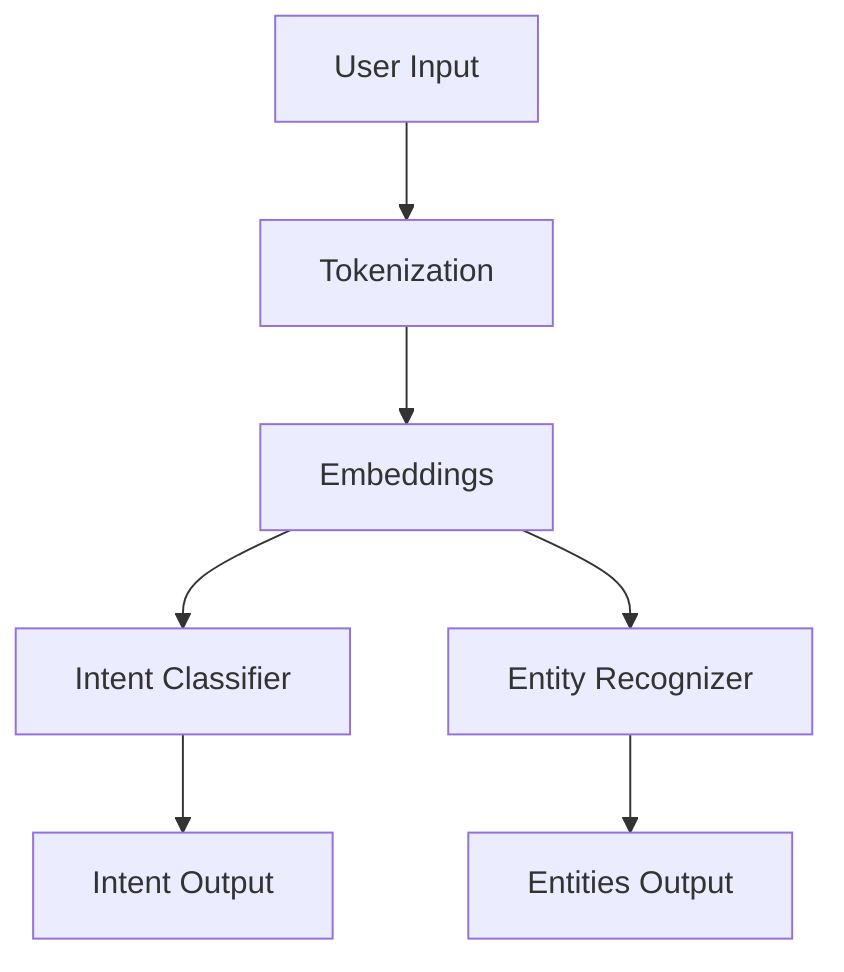

# 02.2. NLU Understating Meaning

  <table>
    <tr>
      <td align="center"></td>
      <td align="center"></td>
      <td align="center"></td>
      <td align="center"></td>
    </tr>
  </table>

## 02.2.1. Intent Entity Recognition

### <td align="center"> Introduction

Intent & Entity Recognition is at the core of **NLU (Natural Language Understanding)**.
It answers two essential questions:

1. **What is the user trying to do?** → *Intent*
2. **What pieces of information matter in their request?** → *Entities*

Example:

> “Book a flight to New York tomorrow.”

- **Intent:** book_flight  
- **Entities:**  
  - destination = New York  
  - date = tomorrow  

These two components enable chatbots, assistants, and RAG pipelines to interpret user meaning with precision.

---

### <td align="center"> Why use it?

- Understand what the user **wants**  
- Extract **structured data** from unstructured text  
- Enable task automation  
- Power conversational agents  
- Improve accuracy in RAG retrieval  
- Connect natural language with system actions  

---

### <td align="center"> Components

**1. Intent Classification**  
Predicts the *goal* of the utterance.  
Examples:  
- order_pizza  
- cancel_order  
- ask_weather  
- search_product  

**2. Entity Recognition (NER)**  
Extracts key parameters needed to fulfill the intent.  
Common entity types:  
- person  
- location  
- date  
- product  
- amount  
- organization  

**3. Context State**  
Tracks conversation history and filling missing info (slot filling):  
- “I want pizza”  
- “Which size?”  
- “Large.”  

---

### <td align="center"> How it works?

#### Step-by-step Process

1. **Text Input**  
2. **Tokenization & Embeddings**  
3. **NLU Model predicts:**  
   - intent  
   - entities  
4. **Slots filled** from extracted entities  
5. **Actions triggered** (API call, DB query, RAG retrieval…)

#### Simple Diagram

---

### <td align="center"> Use Cases

- Chatbots & Virtual Assistants  
- Customer Support Automation  
- RAG Query Understanding  
- Voice Assistants  
- Search Understanding  
- Forms Extraction  
- Command-based systems (“Play music”, “Turn off lights”)  

---

###  Limitations

- Ambiguous user input  
- Multi-intent sentences  
- Requires good labeled data (unless using LLMs)  
- Domain shift problems  
- Entities with unusual spelling  

---

###  Code/Notebook/Projects

 - [NLP, NLU, NLG with RAG - Make Matthew notebook from bible](https://github.com/gil-son/llm-engineering-lab/tree/main/notebooks/02-NLP-NLU-NLG)

---

###  Video

Recommended to visualize:

  

