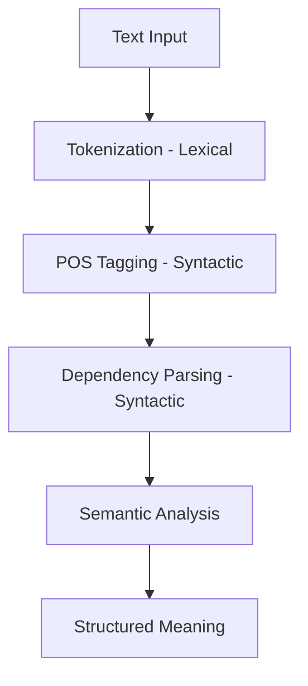

# 02.2. NLU Understating Meaning

  <table>
    <tr>
      <td align="center"></td>
      <td align="center"></td>
      <td align="center"></td>
      <td align="center"></td>
    </tr>
  </table>

## 02.2.2. Semantic Syntactic Analysis

### <td align="center"> Introduction

While Intent & Entity recognition identifies "what" is wanted, **Semantic & Syntactic Analysis** explores "how" the language is structured and "what" it truly means in context.

**Semantic and Syntactic Analysis** are fundamental steps in **Natural Language Understanding (NLU)**.

- **Syntax** focuses on *structure*: how words are arranged in a sentence.
- **Semantics** focuses on *meaning*: what the sentence actually means.

Together, they allow systems to go beyond keyword matching and understand *who did what to whom*, *when*, and *how*.

Example:

> “The model predicts customer churn.”

- **Syntactic structure:**  
  - Subject: *The model*  
  - Verb: *predicts*  
  - Object: *customer churn*

- **Semantic meaning:**  
  - An ML model is responsible for making a prediction about churn.

---

### <td align="center"> Why use it?

- **Ensure Grammatical Correctness:** Validates that input follows the expected linguistic patterns.
- **Resolve Ambiguity:** Differentiates between multiple meanings of the same word (Polysemy).
- **Logical Validation:** Identifies "semantic anomalies" (e.g., "The colorless green ideas sleep furiously").
- **Structural Mapping:** Essential for machine translation and complex query understanding where word order changes meaning (e.g., "Dog bites man" vs. "Man bites dog").

Without semantic and syntactic analysis, systems struggle with:
- Long or nested sentences  
- Passive voice  
- Negation  
- Complex queries  

---

### <td align="center"> How it works?

#### Step-by-step Process

**1. Tokenization (Lexical)**
The input text is split into smaller units called tokens (words, subwords, or symbols).
This step operates at the lexical level, focusing on word boundaries and vocabulary units.

**2. POS Tagging (Syntactic)**
Assigning parts of speech (noun, verb, adjective, etc.) to each token, enabling grammatical analysis.

**3. Dependency Parsing (Syntactic)**
Building a tree structure that represents how words depend on each other
(e.g., which noun is the subject of a verb or which adjective modifies which noun).

**4. Word Sense Disambiguation - WSD (Semantic)**
Selecting the correct meaning of a word based on its context
(e.g., “Apple” as a fruit vs. “Apple” as a company).

**5. Semantic Role Labeling - SRL (Semantic)**
Identifying the roles entities play in an action
(Who did what to whom, when, and how?).

#### Example

Sentence:
> “The data scientist trained the model with historical data.”

- POS tagging:
  - data scientist (noun)
  - trained (verb)
  - model (noun)

- Dependency relations:
  - *trained* → subject → *data scientist*
  - *trained* → object → *model*
  - *trained* → instrument → historical data

#### Diagram

---

### <td align="center"> Components

**1. Lexical Analysis (Pre-Syntactic)**
Operates at the word level before grammatical interpretation.
- Tokenization
- Vocabulary normalization
- Handling subwords and symbols

**2. Syntactic Analysis**
- Part-of-Speech tagging  
- Dependency parsing  
- Constituency parsing  

**3. Semantic Analysis**
- Word meaning  
- Sentence meaning  
- Semantic role labeling (who did what)  

**4. Disambiguation**
- Resolves ambiguity using context  
- Example:
  - “I saw the man with a telescope”  

**5. Meaning Representation**
- Logical forms  
- Graphs  
- Embedding-based representations  

---

### <td align="center"> Use Cases

- Question Answering Systems  
- Search Query Understanding  
- Chatbots & Virtual Assistants  
- RAG Pipelines  
- Legal and Medical NLP  
- Text Summarization  
- Command Interpretation  

---

### Key Takeaway

> **Syntax tells you how a sentence is built.  
> Semantics tells you what it means.  
> Together, they enable true language understanding.**

###  Contents
- [Mindwalkai](https://www.mindwalkai.com/blog/natural-language-understanding-nlu-basics-and-applications-in-bioinformatics)

---

###  Videos

A few recommended resources to visualize:

  

---

  

