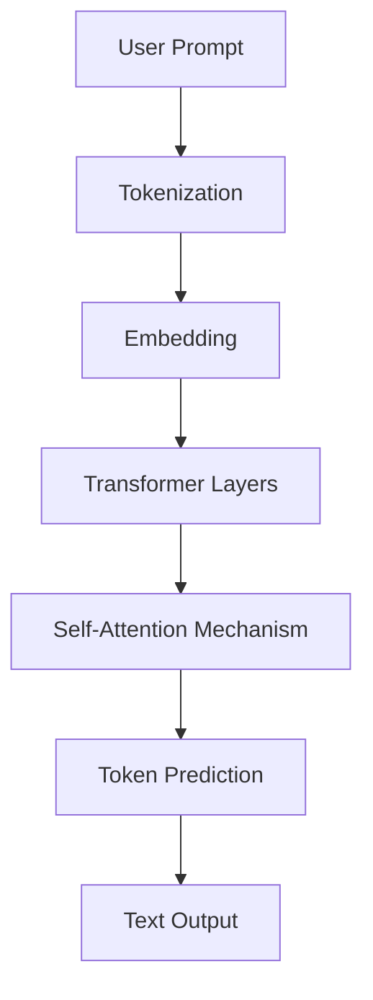

# What is an LLM?

  

 

A **Large Language Model (LLM)** is an advanced machine learning model trained on vast amounts of text data to understand, generate, and interact using human language.  
These models are based on the **Transformer architecture** and can perform a wide variety of Natural Language Processing (NLP) tasks, such as:

- Answering questions  
- Writing and debugging code  
- Translating languages  
- Summarizing text  
- Reasoning and problem-solving  

LLMs are at the core of modern AI applications like **ChatGPT, Claude, and Google Gemini**, and are transforming how businesses, developers, and users interact with machines.

---

<h3> Frontier LLMs</h3>

#### Closed-Source
- **GPT (OpenAI)** – Industry leader in general-purpose reasoning, coding, and conversation. Known for ChatGPT.  
- **Claude (Anthropic)** – Emphasizes safety and constitutional AI. Strong at long-context understanding.  
- **Gemini (Google DeepMind)** – Integrates with Google’s ecosystem; strong at multimodal reasoning (text, images, code).  
- **Command R (Cohere)** – Optimized for retrieval-augmented generation (RAG) and enterprise workflows.  
- **Perplexity** – Hybrid model + search engine; optimized for real-time question answering with citations.  

#### Open-Source
- **LLaMA (Meta)** – A family of open models widely adapted for fine-tuning and research.  
- **Mixtral (Mistral)** – Sparse Mixture-of-Experts (MoE) architecture, offering efficiency with strong performance.  
- **Qwen (Alibaba Cloud)** – Open models with strong multilingual support, especially for Asian languages.  
- **Gemma (Google)** – Lightweight models released for research and local development.  
- **Phi (Microsoft)** – Small, efficient models optimized for reasoning with surprisingly strong results.  

---

### Ways to Use LLMs

1. **Chat Interfaces**  
   - Direct interaction via web or desktop apps.  
   - Examples: **ChatGPT**, **Claude.ai**, **Gemini**.  

2. **Cloud APIs**  
   - REST/GraphQL APIs from OpenAI, Anthropic, Cohere, etc.  
   - Integration frameworks: **LangChain**, **Semantic Kernel**.  
   - Managed AI cloud services:  
     - **Amazon Bedrock** – multi-model API access.  
     - **Azure ML** – enterprise-grade ML + deployment.  
     - **Vertex AI** – Google’s managed ML/LLM platform.  

3. **Direct Inference**  
   - **Hugging Face Transformers** library for model loading + fine-tuning.  
   - **Ollama** or **LM Studio** to run smaller models locally.  
   - Often used when privacy, cost, or customization is critical.  

---

### Capabilities of Frontier Models

- **Synthesizing information** – Produces structured, researched, and summarized answers.  
- **Expanding ideas** – Turns notes into polished drafts (emails, reports, blog posts).  
- **Coding** – Writes, debugs, and explains code; has become a go-to tool for developers.  
- **Multimodality** (some models) – Understands text, images, and sometimes audio/video.  
- **Long-context reasoning** – Some models (Claude, GPT-4 Turbo) can handle 100k+ tokens.  

---

### Limitations

- **Specialized knowledge** – Still below human experts in narrow fields (e.g., medicine, law).  
- **Knowledge cut-off** – Training data limits awareness of very recent events.  
- **Hallucinations** – Can confidently output false information.  
- **Cost and efficiency** – Frontier closed-source APIs can be expensive at scale.  
- **Data privacy** – Using APIs means sending data externally; may conflict with enterprise security needs.  

  
---

 <h3>What problems do LLMs solve?</h3>

  
LLMs help address a range of language-related challenges:

- **Language Understanding**: Enables machines to comprehend and interpret natural language.
- **Text Generation**: Automates content creation across a wide variety of formats.
- **Question Answering**: Powers intelligent search and conversational interfaces.
- **Translation and Summarization**: Improves access to global information and compresses long content.
- **Code Assistance**: Supports software development by writing or explaining code.

---

<h3>What are the benefits of LLMs?</h3>

Key advantages of using LLMs include:

- **High Versatility**: One model can perform dozens of NLP tasks with minimal tuning.
- **Zero/Few-shot Learning**: LLMs can complete new tasks by simply providing examples in a prompt.
- **Productivity Boost**: Speeds up writing, coding, and content generation.
- **Multilingual Capabilities**: Many LLMs understand and generate text in multiple languages.
- **Human-like Interaction**: Enables more natural communication with machines.

---

<h3> How do LLMs work?</h3>

LLMs are typically based on the **Transformer architecture**. They are trained on massive text datasets to learn statistical patterns of language. Once trained, they use attention mechanisms to generate context-aware responses based on the user’s prompt. LLMs can be fine-tuned or used via **prompt engineering**, **retrieval-augmented generation (RAG)**, or **agent-based systems** to complete more complex tasks.

<h4> Step-by-step Process </h4>

1. **Input (Prompt)**
   - You provide a question, sentence, or instruction to the model.
   - Example: "Explain what a transformer model is."

2. **Tokenization**
   - The input text is broken down into smaller parts called tokens (words, subwords, or characters).
   - These tokens are converted into numbers (IDs) using a vocabulary.

3. **Embedding**
   - The token IDs are transformed into dense vector representations.
   - This allows the model to understand relationships and meaning in a mathematical space.

4. **Transformer Layers (Attention Mechanism)**
   - The input passes through multiple transformer layers.
   - These layers apply **self-attention** to understand context and relationships between words.

5. **Prediction (Decoding)**
   - The model generates the next token(s) based on the learned patterns.
   - This process continues until it completes the response.

6. **Output (Text)**
   - The output tokens are converted back into human-readable text.

---

### Simple Diagram

---

<h3> Typical use cases for LLMs</h3>

Popular applications of LLMs include:

- **Chatbots and Virtual Assistants**: Automate conversations in customer support or internal tools.
- **Content Creation**: Generate blogs, ads, emails, or documentation at scale.
- **Code Generation**: Write or debug code from natural language descriptions.
- **Search and Retrieval**: Enhance search relevance using semantic understanding.
- **Legal and Financial Analysis**: Extract and summarize information from dense documents.
- **Healthcare Applications**: Summarize medical records or generate reports.

---

<h3> Videos</h3>

  

    
  

  

  

    
  

