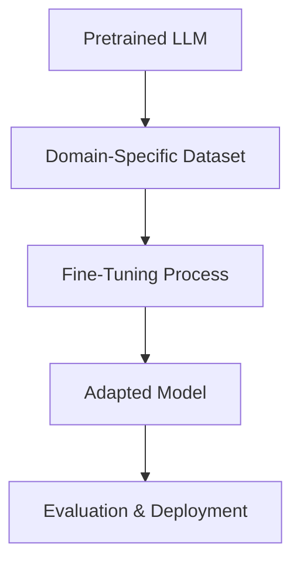

# 1. Fundamentals

  <table>
    <tr>
      <td align="center"></td>
      <td align="center"></td>
    </tr>
  </table>

 

---

  <table>
    <tr>
      <td align="center"></td>
      <td align="center"></td>
      <td align="center"></td>
      <td align="center"></td>
      <td align="center"></td>
      <td align="center"></td>
      <td align="center"></td>
    </tr>
  </table>

 

## 1.6. LLM Fine-tuning

### <td align="center"> Introduction

---

Fine-tuning is the process of taking a **pretrained LLM** and adapting it to perform better on **specific domains, styles, or tasks** by continuing training with a smaller, focused dataset.  
It allows the model to **retain general knowledge** from pretraining while learning **task-specific patterns**.

Common examples include:
- Specializing a base model (like GPT or LLaMA) to handle legal or medical language.
- Aligning model tone with a company’s communication style.
- Improving performance in low-resource languages.

---

### <td align="center"> Why use it?
  
Fine-tuning offers several benefits:

- **Improves accuracy** for niche use cases.  
- **Reduces hallucinations** in specific domains.  
- **Enables smaller, cheaper deployments** by starting from a compact pretrained base.  
- **Customizes tone and intent**, e.g., customer service assistants or chatbots.  
- **Supports instruction-following** and preference alignment (when combined with RLHF).

---

### <td align="center"> Components

- **Base Model:** A pretrained model (e.g., GPT, LLaMA, Falcon).  
- **Dataset:** High-quality, domain-specific data.  
- **Training Objective:** Often causal LM loss (predict next token).  
- **Fine-tuning Framework:** Tools like Hugging Face Transformers, PEFT, LoRA, or Axolotl.  
- **Compute Resources:** GPUs or TPUs for training.  

---

### <td align="center"> How it works?

Fine-tuning adjusts the pretrained model’s weights using task-specific data. It typically involves **continued gradient descent** but with **smaller learning rates** and **careful regularization** to avoid catastrophic forgetting.

#### Step-by-step Process

1. **Load pretrained model** (e.g., LLaMA-2, Falcon, Mistral).  
2. **Prepare dataset** (structured text pairs or domain-specific data).  
3. **Tokenize and format** (prompt-response format, JSON, or text).  
4. **Choose fine-tuning strategy** (Full fine-tuning, LoRA, QLoRA).  
5. **Train with small learning rate** using GPU/TPU.  
6. **Evaluate** with metrics like perplexity, BLEU, or ROUGE.  
7. **Deploy** fine-tuned weights for inference.

#### Simple Diagram

---

### <td align="center"> Use Cases

- **Customer Support Bots:** Trained on company FAQs.  
- **Healthcare Assistants:** Adapted for medical terminology.  
- **Legal Document Summarization:** Trained on law corpora.  
- **Code Generation Models:** Fine-tuned on domain-specific repositories.  
- **Educational Tutors:** Personalized for specific learning domains.

---

###  Limitations

- **Expensive** for large models (GPU cost).  
- **Risk of overfitting** with small datasets.  
- **Data privacy** concerns with proprietary data.  
- **Model drift** if fine-tuned too far from the base domain.  
- **Evaluation challenges** for subjective tasks.  

---

###  Code/Notebook/Projects

[In the soon]

---

###  Videos

A few recommended resources to visualize:

[In the soon]
