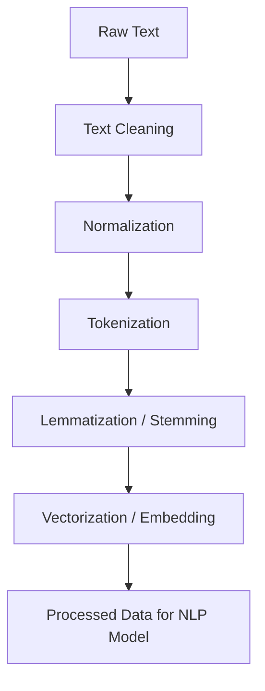

# 02.1. NLP — Processing Language

  <table>
    <tr>
      <td align="center"></td>
      <td align="center"></td>
      <td align="center"></td>
      <td align="center"></td>
    </tr>
  </table>

## 02.1.1. Text Preprocessing / Cleaning / Normalization

### <td align="center"> Introduction

---

Natural Language Processing (NLP) begins with **text preprocessing**, the stage where raw, unstructured text is cleaned and transformed into a consistent format suitable for computational models.

This process ensures that models receive standardized input and can focus on learning semantics rather than handling noise or inconsistencies.

Common preprocessing steps include:
- Text normalization (lowercasing, removing punctuation)
- Tokenization (splitting text into words or subwords)
- Lemmatization and stemming (reducing words to their base forms)
- Removing stop words and special characters
- Handling misspellings, URLs, and emojis

---

### <td align="center"> Why use it?
  
---

Text preprocessing ensures that the input to NLP or LLM systems is:
- **Clean** — free from noise, typos, and irrelevant symbols
- **Consistent** — unified in structure and format
- **Efficient** — reducing unnecessary complexity before vectorization
- **Meaningful** — preserving semantic value while removing redundancy

Without preprocessing, downstream tasks like tokenization, embedding, or model inference can suffer from **data drift**, **inconsistencies**, and **lower accuracy**.

---

### <td align="center"> Components

---

Core components of the text preprocessing pipeline include:

1. **Text Cleaning** — remove URLs, punctuation, HTML tags, and emojis  
2. **Normalization** — convert all text to lowercase, fix contractions, normalize whitespace  
3. **Tokenization** — split text into words, subwords, or characters  
4. **Stopword Removal** — eliminate frequent but low-information words like *“the”*, *“and”*, etc.  
5. **Lemmatization / Stemming** — reduce words to their root or canonical form  
6. **Vectorization** — transform text into numeric representations (TF-IDF, Word2Vec, embeddings)

---

### <td align="center"> How it works?

---

The text preprocessing pipeline transforms unstructured input into clean, tokenized data that can be embedded and processed by models.

#### Step-by-step Process

1. Collect raw text from a source (e.g., documents, user input, web scraping)  
2. Remove unwanted characters, links, and formatting  
3. Normalize case and expand contractions  
4. Tokenize into smaller units (words or subwords)  
5. Apply stemming or lemmatization to unify words  
6. Convert to numerical vectors or embeddings for use in downstream models

#### Simple Diagram

---

### <td align="center"> Use Cases

---

- Preprocessing text for **sentiment analysis**, **topic modeling**, and **text classification**  
- Preparing clean input for **LLM fine-tuning** or **RAG pipelines**  
- Building preprocessing modules for **chatbots** or **voice assistants**  
- Data preparation for **embedding-based retrieval systems** (e.g., ChromaDB, FAISS)

---

###  Limitations

---

- Over-cleaning can **remove important context or meaning**  
- Lemmatization and stemming may **introduce errors** in some languages  
- Handling multilingual text adds **complexity** to preprocessing rules  
- Noise in input data can still propagate if not properly cleaned  

---

###  Code/Notebook/Projects

[In the soon]

---

###  Videos

A few recommended resources to visualize:

[In the soon]
