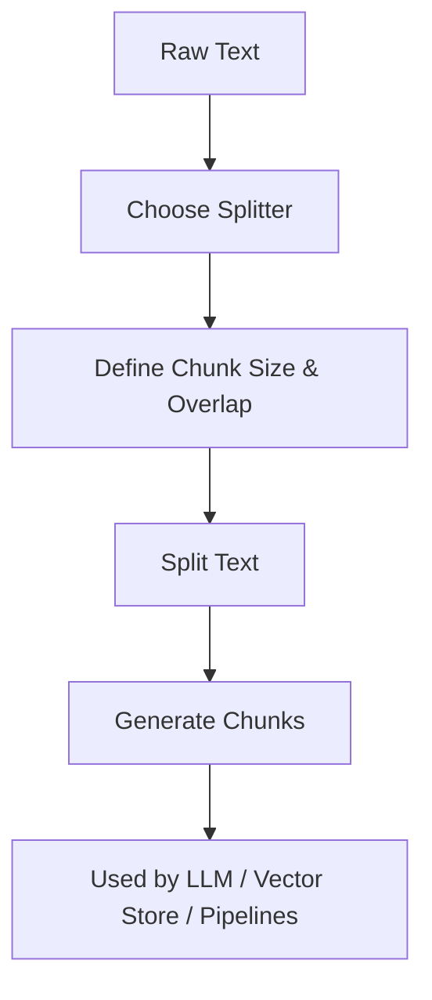

# 02.1. NLP — Processing Language

  <table>
    <tr>
      <td align="center"></td>
      <td align="center"></td>
      <td align="center"></td>
      <td align="center"></td>
    </tr>
  </table>

## 02.1.2. Text Splitting 

### <td align="center"> Introduction

Text splitting is the process of breaking large blocks of text into
smaller, manageable chunks.\
This is essential for NLP tasks, especially when working with LLMs that
operate on limited context windows.

---

### <td align="center"> Why use it?

Why use it?

-   Large texts exceed LLM context window limits
-   Efficient indexing for RAG pipelines
-   Enables parallel processing
-   Reduces noise and improves embedding quality
-   Allows chunk-level retrieval instead of retrieving entire documents

---

### <td align="center"> Components

-   **Chunk Size** --- max number of characters/tokens per split\
-   **Chunk Overlap** --- repeated text between chunks for context
    continuity\
-   **Splitting Strategy**
    -   by character\
    -   by sentences\
    -   by paragraphs\
    -   by semantic boundaries
---

### <td align="center"> How it works?

#### Step-by-step Process

1.  Load and normalize text\
2.  Choose splitting strategy\
3.  Define chunk size and overlap\
4.  Apply split algorithm\
5.  Validate semantic continuity\
6.  Output chunks for further processing (embeddings, indexing, etc.)

#### Simple Diagram

---

### <td align="center"> Use Cases

[In the soon]

###  Limitations

-   Overlapping increases computational cost\
-   Very small chunks reduce semantic meaning\
-   Incorrect strategy harms retrieval quality\
-   Token-level splitting may cut sentences unnaturally

---

###  Code/Notebook/Projects

[In the soon]

---

###  Videos

A few recommended resources to visualize:

[In the soon]
