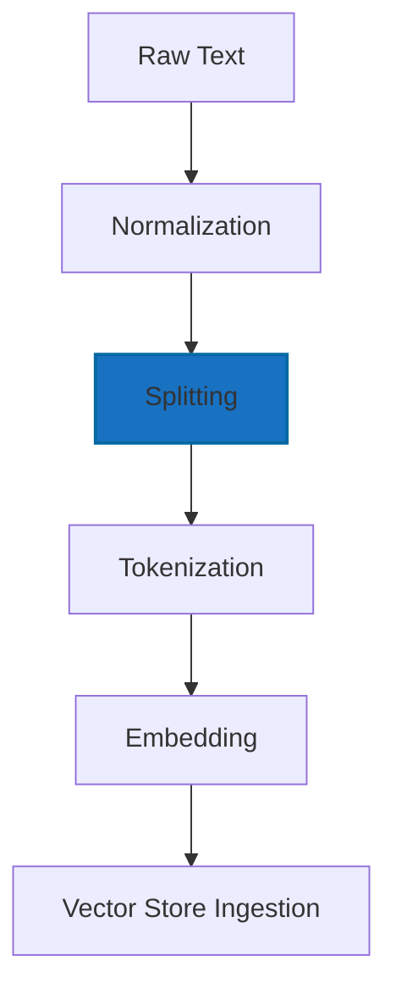
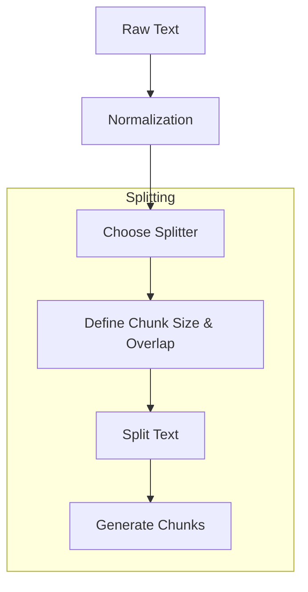

# 02.1. NLP — Processing Language

  <table>
    <tr>
      <td align="center"></td>
      <td align="center"></td>
      <td align="center"></td>
      <td align="center"></td>
    </tr>
  </table>

## 02.1.2. Text Splitting 

### <td align="center"> Introduction

Text splitting is the process of breaking large blocks of text into
smaller, manageable chunks.\
This is essential for NLP tasks, especially when working with LLMs that
operate on limited context windows.

---

### <td align="center"> Why use it?

Why use it?

-   Large texts exceed LLM context window limits
-   Efficient indexing for RAG pipelines
-   Enables parallel processing
-   Reduces noise and improves embedding quality
-   Allows chunk-level retrieval instead of retrieving entire documents

---

### <td align="center"> Components

Core components of the text preprocessing pipeline include:

1. **Text Raw** — unprocessed input; may contain punctuation, emojis, typos, and irregular spacing
2. **Normalization** — unify format (lowercasing, normalize whitespace, expand contractions) 
3. **Splitting** — divide text into sentences or segments for structured processing.
3. **Tokenization** — split text into words, subwords, or characters  
4. **Embeddings** — map tokens to dense numerical vectors encoding meaning.
5. **Vectorization** — transform text into numeric representations (TF-IDF, Word2Vec, embeddings)

If we focus on **Splitting**:
- **Choose Splitter**  
  Select a splitting method or library (e.g., LangChain RecursiveCharacterTextSplitter, SentenceSplitter, MarkdownSplitter).  
  The splitter defines the rules and hierarchy used when breaking the document.

- **Chunk Size**  
  Maximum number of **characters or tokens** per chunk.  
  Character-based splitting is more common because it keeps text readable and compatible with downstream steps.

- **Chunk Overlap**  
  Amount of repeated text between chunks.  
  Provides continuity so retrieval does not miss context around chunk boundaries.

- **Split Text (Strategy)**  
  How the splitter breaks the text:  
  - By characters (most common in RAG)  
  - By sentences  
  - By paragraphs  
  - By Markdown/HTML structure  
  - By semantic similarity (advanced)

- **Generate Chunks**
Produce the final list of processed text segments.
Each chunk includes:
- The selected slice of text
- The defined overlap (if any)
- Clean boundaries aligned with the chosen strategy
These chunks are now ready to be embedded or indexed, ensuring efficient and context-aware retrieval.

---

### <td align="center"> How it works?

---

The pipeline converts raw input into standardized, structured, vectorized data suitable for retrieval or modeling.

Let's go focus on Splitting step:

#### Simple Diagram

We received a block of Normalized Text, and now we start the Splitting process:
1. **Choose Splitter**: Here we choose which strategy or library will break the text.
This includes selecting tools such as RecursiveCharacterTextSplitter, SentenceSplitter, MarkdownSplitter, or any custom rule-based splitter.
The splitter determines the hierarchy (characters → sentences → paragraphs → sections) and how strictly boundaries are respected.
2. **Define Chunk Size & Overlap**: After deciding the splitter, we set the **maximum chunk length** (characters or tokens) and the overlap size.
This controls how large each chunk can be and how much context should repeat across chunks to preserve meaning at boundaries.
3. **Split Text**: The splitter now traverses the normalized text and applies its rules.
Depending on the selected strategy, it may break text by:
- character windows
- sentence boundaries
- paragraphs
- markdown/HTML sections
- or semantic boundaries
The output at this stage is a list of raw segments before overlap insertion.
5. **Generate Chunks**: Finally, the system assembles the processed segments into final chunks, applying overlap and trimming boundaries if needed.
The result is a structured list of chunks ready for tokenization and embedding, each carrying consistent context and size.

---

### <td align="center"> Use Cases

[In the soon]

###  Limitations

-   Overlapping increases computational cost\
-   Very small chunks reduce semantic meaning\
-   Incorrect strategy harms retrieval quality\
-   Token-level splitting may cut sentences unnaturally

---

###  Code/Notebook/Projects

[In the soon]

---

###  Videos

A few recommended resources to visualize:

  

