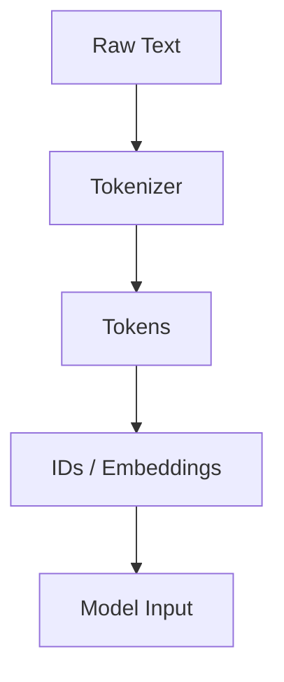

# 2.1. NLP — Processing Language

  <table>
    <tr>
      <td align="center"></td>
      <td align="center"></td>
      <td align="center"></td>
      <td align="center"></td>
    </tr>
  </table>

## 2.1.2. Tokenization 🧩

### <td align="center"> Introduction

---

Tokenization is the process of breaking text into smaller units — called **tokens** — which can be words, subwords, or characters.  
These tokens are the foundation of any Natural Language Processing (NLP) or Large Language Model (LLM) pipeline.

---

### <td align="center"> Why use it?
  
- Models cannot directly understand raw text — they operate on numerical representations.  
- Tokenization creates a **bridge** between human-readable language and machine-readable data.  
- Efficient tokenization improves training and inference speed.

---

### <td align="center"> Components

- **Tokenizer type** (Word, Subword, Character, Byte-Pair Encoding, SentencePiece)
- **Vocabulary** — the set of all tokens the model recognizes
- **Special tokens** (e.g., `[PAD]`, `[CLS]`, `[SEP]`, `<s>`, `</s>`)
- **Token IDs** — numerical identifiers assigned to tokens

---

### <td align="center"> How it works?

1. Input text is read as a raw string.  
2. Tokenizer splits text into words or subwords.  
3. Each token is mapped to an ID from the vocabulary.  
4. The model uses these IDs for training or inference.

#### Step-by-step Process

1. Input: `"I love NLP!"`
2. Tokenization: `["I", "love", "NLP", "!"]`
3. IDs: `[101, 1045, 2293, 17953, 999, 102]`
4. Model processes IDs → outputs prediction

#### Simple Diagram

---

### <td align="center"> Use Cases

- Preparing datasets for fine-tuning LLMs  
- Building chatbots and assistants  
- Preprocessing for translation or summarization  
- Enabling token-efficient inference in production

---

###  Limitations

- Tokenizers trained on limited data may struggle with rare or multilingual words.  
- Different tokenization methods lead to inconsistencies across models.  
- Subword-level tokenization may break linguistic coherence.

---

###  Code/Notebook/Projects

- [Create an LLM from scratch](https://github.com/gil-son/llm-engineering-lab/tree/main/notebooks/01-transformer-lm)

---

###  Videos

[In the soon]
