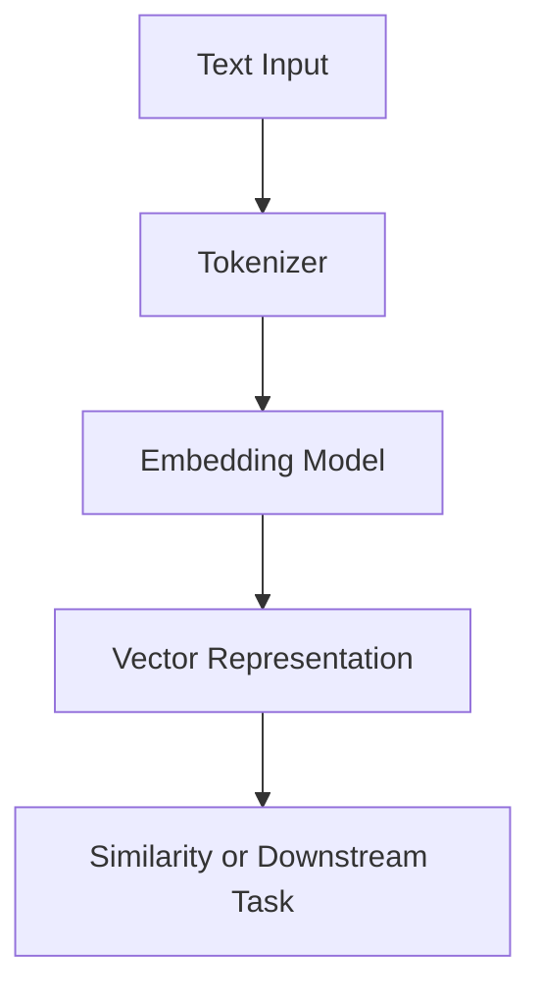

# 2.1.3. Embeddings Vectors

  <table>
    <tr>
      <td align="center"></td>
      <td align="center"></td>
      <td align="center"></td>
      <td align="center"></td>
    </tr>
  </table>

### <td align="center"> Introduction

---

Embeddings are numerical vector representations of text (words, sentences, or documents) that capture their **semantic meaning**. They allow machines to understand relationships between words — like similarity, context, and meaning — in a **continuous vector space**.

For example:
- “King” - “Man” + “Woman” ≈ “Queen”  
- Similar sentences will have similar embedding vectors.

---

### <td align="center"> Why use it?
  
- To represent text numerically for ML/LLM models.  
- To capture **semantic similarity** rather than surface-level similarity.  
- To enable efficient search, clustering, and reasoning over language.  
- Essential for **RAG pipelines**, **semantic search**, and **recommendation systems**.

---

### <td align="center"> Components

1. **Tokenization** – break text into tokens.  
2. **Embedding model** – transform tokens into dense vectors.  
3. **Vector space** – multidimensional space where meaning is encoded.  
4. **Similarity metric** – measure relationships (e.g., cosine similarity).  

---

### <td align="center"> How it works?

#### Step-by-step Process

1. Input text is tokenized.  
2. Each token is mapped to an embedding vector (learned during training).  
3. These vectors are combined to represent sentences or documents.  
4. Similar meanings → similar vectors in high-dimensional space.

#### Simple Diagram

---

### <td align="center"> Use Cases

- **Semantic Search** (find text with similar meaning)  
- **Recommendation Systems**  
- **RAG Pipelines** (Retrieve relevant documents by vector similarity)  
- **Clustering or Visualization of text**  
- **Intent Detection or Classification**  

---

###  Limitations

- Embeddings depend on the **training corpus** → bias risk.  
- High-dimensional vectors can be **computationally expensive**.  
- Semantic similarity ≠ logical reasoning.  
- May fail for **rare words or domain-specific jargon**.

---

###  Code/Notebook/Projects

- [Create an LLM from scratch](https://github.com/gil-son/llm-engineering-lab/tree/main/notebooks/01-transformer-lm)

---

###  Videos

A few recommended resources to visualize:

  

  

