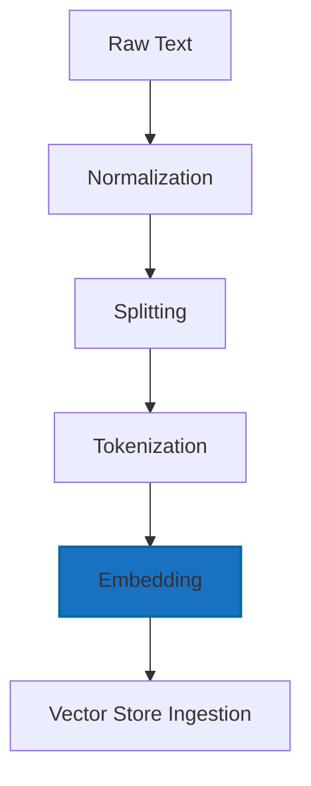
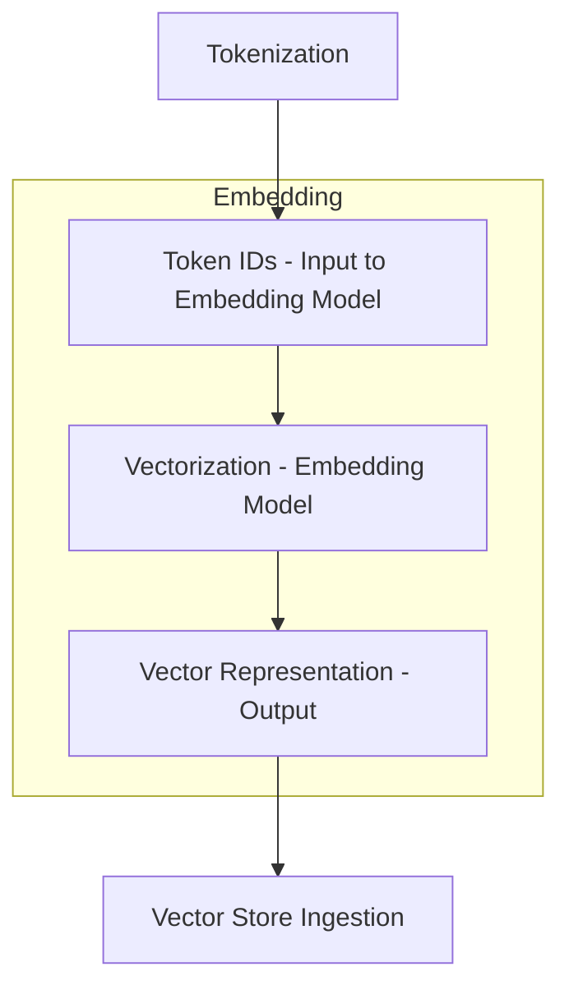

# 02.1. NLP — Processing Language


<div align="center">
  <table>
    <tr>
      <td align="center"></td>
      <td align="center"></td>
      <td align="center"></td>
      <td align="center"></td>
    </tr>
  </table>
</div>

## 02.1.4. Embeddings Vectors

### <td align="center"> Introduction

---

Embeddings are numerical vector representations of text (words, sentences, or documents) that capture their **semantic meaning**. They allow machines to understand relationships between words — like similarity, context, and meaning — in a **continuous vector space**.

For example:
- “King” - “Man” + “Woman” ≈ “Queen”  
- Similar sentences will have similar embedding vectors.

---

### <td align="center"> Why use it?
  
- To represent text numerically for ML/LLM models.  
- To capture **semantic similarity** rather than surface-level similarity.  
- To enable efficient search, clustering, and reasoning over language.  
- Essential for **RAG pipelines**, **semantic search**, and **recommendation systems**.

---

### <td align="center"> Components

1. **Text Raw** — unprocessed input; may contain punctuation, emojis, typos, and irregular spacing
2. **Normalization** — unify format (lowercasing, normalize whitespace, expand contractions) 
3. **Splitting** — divide text into sentences or segments for structured processing.
3. **Tokenization** — split text into words, subwords, or characters  
4. **Embeddings** — map tokens to dense numerical vectors encoding meaning.
5. **Vectorization** — transform text into numeric representations (TF-IDF, Word2Vec, embeddings)

If we focus on **Embeddings**:

- **Tokens → Token IDs:** The tokenizer maps each token to an integer ID from the model’s vocabulary. Example:
```
  ["intelligent", "agent"] → [49281, 1287]
```

- **Vectorization - Embedding Model:** The embedding model converts each token ID into a high-dimensional vector.
This step uses a learned embedding matrix or a transformer-based encoder to generate vectors that encode:
    - semantics
    - context
    - relationships between concepts
 Example:

```
  49281 → [0.12, -0.88, 0.47, ...] (typically 384–1536 dimensions)
```

- **Vector Representation - Output:** The final output is a dense vector that represents the meaning of the text chunk, sentence, or document. These vectors can then be used for:
similarity search
  - retrieval in RAG systems
  - clustering
  - classification
  - semantic search

The vector is what gets stored in the Vector Store, not the text itself.
Example (embedding for the whole chunk):

```
  [0.21, 0.09, -0.77, 0.33, ...]
```
---

### <td align="center"> How it works?

#### Step-by-step Process

The pipeline converts raw input into standardized, structured, vectorized data suitable for retrieval or modeling.

Let's go focus on **Embeddings** step:

#### Simple Diagram


How we saw during Tokenization, every chunk is converted into tokens and then into Token IDs.
The Embedding step consumes those IDs and produces numeric vector representations.

- **1. Token IDs (Input to Embedding Model)**
  - Before embedding, text is already represented as integer IDs. Example:
    - Tokens: ["Ne", "ural", " network", "s"]
    - IDs: [101, 1045, 2293, 17953]

These IDs are the fundamental inputs for the embedding model.
      
- **2. Token IDs (Input to Embedding Model):** the embedding model takes each token ID (or the entire chunk) and transforms it into a dense vector using learned weights.
  - It's basically a **lookup** into a giant matrix (for token-level embeddings) **or**
  - A full forward pass through a smaller model (for text-embedding models like OpenAI text-embedding-3 or Sentence Transformers)


- **3. Vector Representation (Output):** the output is a high-dimensional vector (e.g., 768, 1024, 1536 dimensions) that mathematically captures the meaning of the text. Examples:
  ```
      [
        0.023, -0.117, 0.884, 0.002, ...  (1536 imensions)
      ]
  ```
This vector becomes the unit stored inside the Vector Database / Vector Store.



In the next step, we’ll explore Vector Store Ingestion.

---

### <td align="center"> Use Cases

- **Semantic Search** (find text with similar meaning)  
- **Recommendation Systems**  
- **RAG Pipelines** (Retrieve relevant documents by vector similarity)  
- **Clustering or Visualization of text**  
- **Intent Detection or Classification**  

---

###  Limitations

- Embeddings depend on the **training corpus** → bias risk.  
- High-dimensional vectors can be **computationally expensive**.  
- Semantic similarity ≠ logical reasoning.  
- May fail for **rare words or domain-specific jargon**.

---

###  Code/Notebook/Projects

 - [NLP, NLU, NLG with RAG - Make Matthew notebook from bible](https://github.com/gil-son/llm-engineering-lab/tree/main/notebooks/02-NLP-NLU-NLG)


---

###  Videos

A few recommended resources to visualize:

<div align="center">
  <a href="https://www.youtube.com/watch?v=izbifbq3-eI" target="_blank">
      
  </a>
</div>
<hr/>
<div align="center">
  <a href="https://www.youtube.com/watch?v=wgfSDrqYMJ4" target="_blank">
      
  </a>
</div>
