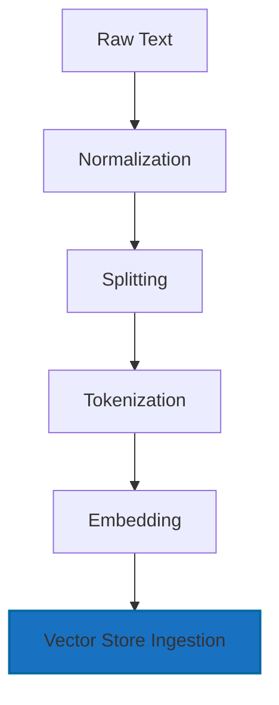
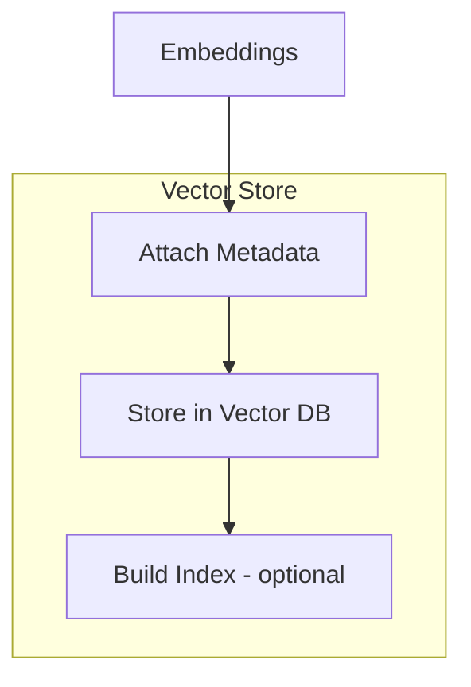
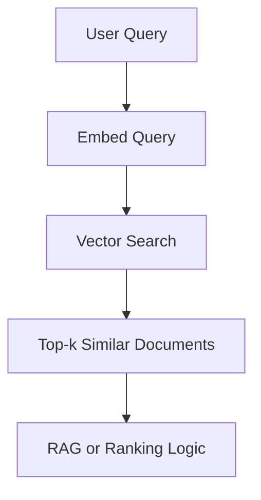

# 02.1. NLP — Processing Language

<div align="center">
  <table>
    <tr>
      <td align="center"></td>
      <td align="center"></td>
      <td align="center"></td>
      <td align="center"></td>
    </tr>
  </table>
</div>

## 02.1.5. Ingestion Vector Store

### <td align="center"> Introduction

Once text has been transformed into **embeddings**, the next step in the
NLP pipeline is to **store** these vectors in a specialized database
called a **Vector Store**.\
This enables fast and accurate retrieval based on **semantic
similarity** --- the foundation of modern **RAG pipelines**, **semantic
search**, **recommendation engines**, and more.

Vector Store Ingestion is the process of:

1.  Preparing text chunks\
2.  Embedding them into dense vectors\
3.  Storing metadata + vectors inside a Vector Database\
4.  Making them queryable for downstream tasks (RAG, search, clustering,
    etc.)

---

### <td align="center"> Why use it?

-   Enables **semantic retrieval**, not keyword lookup\
-   Allows **fast nearest-neighbor search** (ANN algorithms)\
-   Stores relationships between text pieces\
-   Supports ranking, filtering, and hybrid search\
-   Essential for **LLM-powered assistants** that need context

---

### <td align="center"> Components

Each document chunk typically stores:

-   **id** --- unique identifier
-   **vector** --- embedding representation (e.g., 768--1536 dimensions)
-   **metadata** --- useful extra information:
    -   original text
    -   source path
    -   chunk number
    -   tags or labels
    -   timestamps

Example metadata:

``` json
{
  "id": "chunk_15",
  "source": "docs/intro.txt",
  "chunk_index": 15,
  "topic": "embeddings"
}
```

### <td align="center"> How it works?

#### Step-by-step Process

The pipeline converts raw input into standardized, structured, vectorized data suitable for retrieval or modeling.

Let's go focus on **Vector Store Ingestion** step:

#### Simple Diagram



**Before Ingestion: What We Already Have**:

After the Tokenization step, each chunk is converted into tokens, and then mapped to Token IDs.:

```
Tokens: ["Ne", "ural", " network", "s"]
IDs:    [101, 1045, 2293, 17953]
```

During the Embedding step, those IDs are transformed into high-dimensional vectors.:

```
[
  0.023, -0.117, 0.884, 0.002, ... (768–1536 dims)
]
```

At this point, the system has:

- text chunks
- embeddings for each chunk

Now we can move into Vector Store Ingestion.
**Ingestion Vector Store**:

**Attach Metadata:** each embedding must be stored with associated metadata so we can::

- filter results
- reconstruct original text
- trace the source
- support chunk ordering

Example Metadata:

``` json
{
  "id": "chunk_0032",
  "source": "docs/intro.txt",
  "chunk_index": 32,
  "title": "Embeddings Overview",
  "tags": ["nlp", "vector-search", "rag"]
}
```

You now have:
- vector
- id
- metadata

Ready to store.

**Store in Vector DB:** At this stage, the ingestion pipeline writes the data into your vector database:

``` python

vector_store.add(
    id="chunk_0032",
    vector=[0.023, -0.117, 0.884, ...],
    metadata={
        "source": "docs/intro.txt",
        "chunk_index": 32
    }
)

```

The vector DB persists:
- the dense vector
- its unique identifier
- all metadata fields
This allows fast lookup and contextual retrieval later.

**Build Index (Optional but Recommended):** depending on the database (Pinecone, Qdrant, Weaviate, Chroma), an ANN (Approximate Nearest Neighbor) index may be built automatically or manually.

Index options include:

- HNSW (Hierarchical Navigable Small Worlds): high recall, fast
- IVF (Inverted File Index): good for large datasets
- PQ (Product Quantization): compresses vectors to reduce memory

Purpose:
- massively speed up similarity search
- reduce compute cost
- scale to millions or billions of vectors

Example: Qdrant HNSW index:

``` json
{
  "index": "hnsw",
  "ef_construct": 200,
  "m": 16
}

```

Then:



After ingestion, queries follow:



The query itself is turned into an embedding → compared with all stored
vectors → returns the closest ones.

---

### <td align="center"> Use Cases

Vector Store ingestion enables multiple AI and NLP capabilities. The most common use cases include:

-   **RAG Pipelines:** retrieve semantically relevant documents to provide external knowledge for LLM responses.
-   **Semantic Search:** search based on meaning rather than exact keyword matching, improving accuracy and user experience.
-   **Intent Classification:** use vector similarity to classify user queries into categories by comparing them with known examples.
-   **Document Retrieval:** efficiently locate specific passages or sections across large collections of text.
-   **Chat with your Data:** combine embeddings + retrieval to enable conversational interfaces over custom documents or knowledge bases.
-   **Knowledge Graph + Vector Hybrid Systems:** blend symbolic reasoning (KGs) with semantic lookup (vectors) for richer and more accurate retrieval.

###  Common Vector Databases

Some of the most widely used vector databases in production are:
-   **Pinecone:** fully managed vector DB optimized for large-scale, low-latency similarity search; widely used for RAG systems.
-   **Weaviate:** open-source vector database with hybrid search, schema support, class-based organization, and built-in ML modules.
-   **Qdrant:** high-performance open-source vector DB with strong filtering capabilities, payload storage, and efficient HNSW indexing.
-   **ChromaDB:** lightweight, developer-friendly vector store commonly used in prototyping and local RAG pipelines.
-   **Milvus:** enterprise-grade vector database designed for massive-scale data ingestion and ANN search, often used in production clusters.
-   **Elastic (kNN vectors):** extends Elasticsearch with vector search support, allowing hybrid queries that mix keyword search + semantic similarity.

###  Code/Notebook/Projects

 - [NLP, NLU, NLG with RAG - Make Matthew notebook from bible](https://github.com/gil-son/llm-engineering-lab/tree/main/notebooks/02-NLP-NLU-NLG)

------------------------------------------------------------------------

###  Videos

Recommended to visualize vector databases:

[Coming soon]
