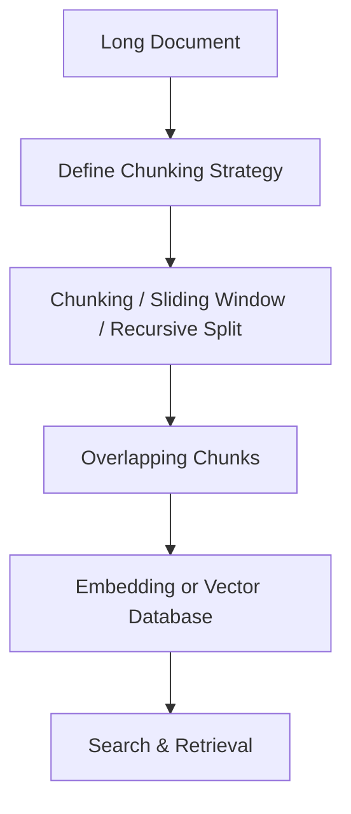

# 02-2-5-Text-Splitting

# What is Text Splitting?

To use the Vector Database effectively, it is important to understand the "tokens" and "chunks"

We've discussed "tokens," which are the individual parts of a sentence. Now, we'll look at "chunks," which are pieces of a document containing tokens. How you divide your data into tokens and chunks affects how AI processes it.

So, **Text Splitting** is the process of dividing long documents into smaller, more manageable chunks before embedding or processing with Large Language Models (LLMs). 

  

 

Because LLMs have a **context window limit** (a maximum number of tokens they can handle), text splitting ensures that large documents can be broken down into overlapping or structured parts while preserving semantic meaning.  

This step is critical in **Retrieval-Augmented Generation (RAG)**, document search, and summarization pipelines.  

---

<h3>Why is text splitting necessary?</h3>
  

Text splitting solves key challenges:  

- **Context Window Limits**: Prevents exceeding the model’s token limit.  
- **Efficient Retrieval**: Smaller chunks improve the accuracy of similarity search in vector databases.  
- **Semantic Preservation**: Splitting ensures chunks retain meaningful context.  
- **Overlap Handling**: Maintains context flow across sections of text.  

  

---

<h3>How does text splitting work?</h3>
  

Text splitting can be performed in multiple ways:  

1. **Chunking**  
   - Breaks text into fixed-size pieces (e.g. 500 tokens).
        - Breaks text into fixed-size pieces. Often used with overlap.
        - Example:
            - Text length ≈ 1100 tokens, chunk size ≈ 470, overlap = 45
            
   - May include **overlap** (e.g. 500 tokens with 50-token overlap) to preserve context.

3. **Sliding Window**  
   - A moving window of tokens is applied, sliding by a fixed step.  
   - Example: Window size = 400, step size = 100 → creates overlapping chunks.

4. **Recursive Character Splitting**  
   - Splits text hierarchically: paragraphs → sentences → words → characters.  
   - Useful for documents with irregular structure (e.g., legal texts, logs).  
   - Example Process:
        - Split by paragraph (\n\n)
        - If too long, split by sentence (.)
        - If still long, split by words or characters
---

### Step-by-step Process  

1. **Input Document**  
   - Example: A research paper of 10,000 tokens.  

2. **Define Chunking Strategy**  
   - Fixed-size chunks: 500 tokens.  
   - Overlap: 50 tokens between chunks.  

3. **Split into Chunks**  
   - Document → `[Chunk 1, Chunk 2, Chunk 3, …]`.  

4. **Optional Recursive Splitting**  
   - Large chunk → split by sentences → fallback to words if too long.  

5. **Pass Chunks to Embedding / RAG**  
   - Each chunk is vectorized for similarity search.  

---

### Simple Diagram  

  

---

<h3>Common splitting techniques</h3>
  

- **Fixed-size Chunking**: Simple, fast, but may cut sentences in half.  
- **Overlapping Chunking**: Preserves semantic flow between chunks.
    - One way to prevent AI from hallucinating is to use "chunk overlap." This means reserving a certain number of tokens from the current chunk with those from the previous chunk, ensuring that the context of the chunks is related to each other.
    - 

    - 

    
Tip: on average, a good overlap rate for document indexing is around 20%, for every 1000 tokens, 200 tokens will be overlapping

    
- **Recursive Splitting**: Smart fallback that keeps chunks semantically valid.  
- **Sliding Windows**: Great for maintaining sequential context.  

  

---

<h3>Best practices</h3>
  

- Match chunk size to the **embedding model’s max token length**.
- Use **overlap (10–20%)** to avoid losing context between chunks.  
- Apply **recursive splitting** for structured or irregular data.  
- Test different chunk sizes for performance vs accuracy tradeoffs.  

  

---

<h3>Videos</h3>
  

  
    

  

  

  
    

  

  

<h3>Resources</h3>

- <a href="https://baoyu.io/translations/rag/5-levels-of-text-splitting">baoyu.io</a>
- <a href="https://medium.com/@anestesya/desvendando-o-vector-database-como-turbinar-sua-ia-com-dados-da-empresa-e-evitar-alucina%C3%A7%C3%B5es-a2c4f5c785f0">medium - anestesya</a>
