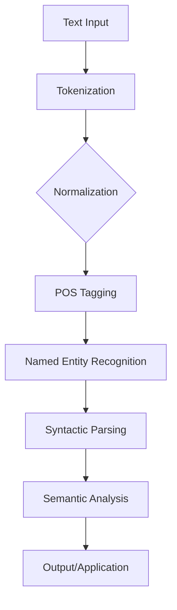

02-3-NLP-Basics

# NLP-Basics

# What is Natural Language Processing (NLP)?

  

 

**Natural Language Processing (NLP)** is a field of artificial intelligence that enables computers to understand, interpret, and generate human language. It combines computational linguistics—rule-based modeling of human language—with machine learning, deep learning, and statistical methods. The goal of NLP is to bridge the gap between human communication and computer understanding.

NLP is a foundational technology for many modern AI applications, including virtual assistants, spam filters, sentiment analysis tools, and machine translation services.

---

 <h3>What problems do NLP solve?</h3>

  
NLP helps address a range of language-related challenges:

- **Information Extraction**: Identifying and extracting specific data from unstructured text.
- **Sentiment Analysis**: Determining the emotional tone or opinion expressed in text.
- **Machine Translation**: Automatically converting text or speech from one language to another.
- **Text Summarization**: Condensing long documents into shorter, coherent summaries.
- **Speech Recognition**: Converting spoken language into written text.
- **Spam Detection**: Filtering unwanted emails or messages based on their linguistic patterns.

---

<h3>What are the benefits of NLP?</h3>

Key advantages of using NLP include:

- **Automated Data Processing**: Efficiently processing and analyzing vast amounts of text data.
- **Improved Customer Service**: Powering chatbots and virtual agents for instant support.
- **Enhanced Search Capabilities**: Providing more relevant search results through semantic understanding.
- **Global Communication**: Facilitating understanding across different languages.
- **Data-driven Insights**: Extracting valuable insights from unstructured text data for business intelligence.

---

<h3>How do NLP systems work?</h3>

NLP systems typically involve several stages, from processing raw text to extracting meaning and generating responses. While specific techniques vary, many modern NLP approaches leverage machine learning models to learn patterns from data.

<h4> Step-by-step Process </h4>

1. **Text Input**
   - Raw text data is provided to the NLP system.
   - Example: "The quick brown fox jumps over the lazy dog."

2. **Tokenization**
   - The input text is broken down into individual units (words, phrases, symbols) called tokens.
   - Example: ["The", "quick", "brown", "fox", "jumps", "over", "the", "lazy", "dog", "."]

3. **Normalization (e.g., Stemming/Lemmatization)**
   - Words are reduced to their root form to standardize them for analysis.
   - Example (Lemmatization): "jumps" -> "jump", "dogs" -> "dog"

4. **Part-of-Speech Tagging**
   - Each token is assigned a grammatical category (e.g., noun, verb, adjective).
   - Example: "quick" (Adjective), "fox" (Noun)

5. **Named Entity Recognition (NER)**
   - Identifying and classifying named entities in the text (e.g., person names, organizations, locations).
   - Example: "Barack Obama" (Person), "Google" (Organization)

6. **Syntactic Parsing**
   - Analyzing the grammatical structure of sentences to understand relationships between words.
   - This can involve dependency parsing or constituency parsing.

7. **Semantic Analysis**
   - Extracting the meaning or interpretation from the text, going beyond literal word meanings.
   - This can include sentiment analysis or word sense disambiguation.

8. **Output/Application**
   - The processed and analyzed information is used for specific NLP applications (e.g., translation, summarization, chatbot response).

---

### Simple Diagram

---

<h3> Videos</h3>

  

    
    
  

  

  

    
  

  

