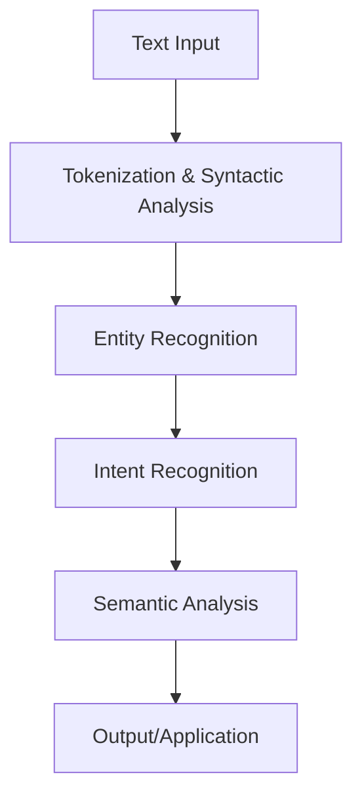

NLU-Intro
What is Natural Language Understanding (NLU)?

 

Natural Language Understanding (NLU) is a subfield of artificial intelligence and a key component of Natural Language Processing (NLP). Its primary goal is to enable computers to comprehend the meaning, context, and intent behind human language, moving beyond the literal interpretation of words. NLU is what allows machines to understand the nuances of human communication, including slang, sarcasm, and complex sentence structures.

It is a critical technology for modern AI applications, such as conversational AI, virtual assistants, and sentiment analysis tools, enabling them to provide more accurate and human-like interactions.

 <h3>What problems do NLU solve?</h3>

NLU addresses the challenges of interpreting human language with all its complexities:

- **Intent Recognition:** Determining the user's goal or purpose behind a query (e.g., understanding that "Book a flight to New York" is a request to book a flight).

- **Entity Recognition:** Identifying and classifying key information in text, such as names of people, places, organizations, and dates.

- **Sentiment Analysis:** Analyzing the emotional tone (positive, negative, neutral) of a piece of text to understand public opinion or customer feedback.

- **Handling Ambiguity:** Resolving cases where words or sentences can have multiple meanings based on their context.

- **Semantic Understanding:** Extracting the underlying meaning of text, going beyond the literal words.

<h3>What are the benefits of NLU?</h3>

Key advantages of using NLU include:

- **Improved Conversational AI:** Enabling chatbots and virtual assistants to have more natural, context-aware conversations.
- **Enhanced User Experience:** Providing more accurate and personalized responses to user queries.
- **Automated Data Insights:** Extracting valuable, structured insights from large volumes of unstructured text data like customer reviews and social media posts.
- **Efficient Operations:** Automating tasks like customer support ticket routing and fraud detection by understanding the intent and context of communications.
- **Global Communication:** Facilitating multilingual understanding and better machine translation by capturing the semantic meaning of text.

<h3>How do NLU systems work?</h3>

NLU systems typically work by combining linguistic rules with advanced machine learning models. The goal is to transform raw text into a structured, machine-readable format that captures its meaning.

<h4> Step-by-step Process </h4>

1. **Text Input**

Raw text or spoken language is provided to the NLU system.

Example: "I want to order a pizza for tomorrow night."

2. **Tokenization & Syntactic Analysis**

The input is broken into tokens, and the grammatical structure is analyzed to understand the relationships between words.

Example: The system recognizes "I" as the subject, "want" as the verb, and "order a pizza" as the object.

3. **Entity Recognition**

Key entities are identified and classified.

Example: pizza (product), tomorrow night (date/time).

4. **Intent Recognition**

The overall goal of the user's query is determined.

Example: The system identifies the user's intent as place_order.

5. **Semantic Analysis**

The meaning of the entities and the overall intent are interpreted in context.

Example: The system understands that "tomorrow night" refers to a specific time for delivery.

6. **Output/Application**

The structured, analyzed information is used to perform a specific action, such as placing an order, providing a response, or logging a request.

Simple Diagram
Snippet de código

<h3> Videos</h3>

  

