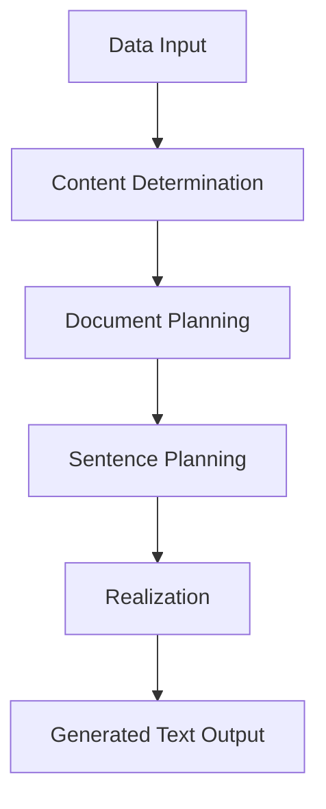

NLG-Overview

What is Natural Language Generation (NLG)?

 

Natural Language Generation (NLG) is a subfield of artificial intelligence and a key component of Natural Language Processing (NLP). It is the process by which a computer system automatically creates understandable, human-like text or speech from structured data. While Natural Language Understanding (NLU) focuses on a machine comprehending language, NLG is its counterpart—the machine's ability to "write" or "speak."

 <h3>What problems do NLG solve?</h3>

NLG addresses a number of challenges related to turning data into meaningful communication:

- **Automated Reporting:** Converting large, complex datasets into easy-to-read reports or summaries, saving significant time and effort.
- **Content Creation at Scale:** Generating large volumes of consistent content, such as product descriptions, financial summaries, or news articles, far faster than a human could.
- **Personalization:** Creating customized messages, emails, or recommendations tailored to individual users based on their data.
- **Streamlined Communication:** Powering chatbots and virtual assistants to provide real-time, context-aware, and human-sounding responses to user queries.
- **Data-to-Text Translation:** Transforming complex numerical data and analytics results into simple, understandable narratives for non-technical users.

<h3>What are the benefits of NLG?</h3>

Key advantages of using NLG include:

- **Increased Efficiency and Speed:** Automating repetitive writing tasks, which significantly speeds up content production and frees up human resources for more strategic work.
- **Cost-Effective Content Creation:** Reducing the need for a large in-house writing staff by generating high-quality content at a lower cost.
- **Consistency and Uniformity:** Ensuring that all generated content adheres to a consistent brand voice, style, and tone, eliminating human error or variations.
- **Scalability:** Producing vast amounts of content on-demand, making it possible for businesses to scale their content efforts without a proportional increase in costs.
- **Enhanced Customer Experience:** Providing immediate, personalized, and accurate responses through chatbots and virtual assistants, leading to better customer service and engagement.

<h3>How do NLG systems work?</h3>

NLG systems follow a typical pipeline that transforms non-linguistic data into structured and then realized text. The process is often broken down into three main stages:

<h4> Step-by-step Process </h4>

1. **Content Determination & Planning**

- The system decides what information from the data should be included in the final text.
- It then creates a high-level document plan, outlining the overall structure and narrative flow.
- Example: From a sales database, the system selects key metrics like revenue and top-selling products to include in a report.

2. **Sentence Planning**

- This stage is also called "microplanning." It involves making decisions about how to phrase the content.
- This includes tasks like lexical choice (choosing the right words, e.g., "fast" vs. "rapid"), sentence aggregation (combining similar sentences), and referring expression generation (deciding how to refer to entities, e.g., using a pronoun like "it" or "they").

3. **Realization**

- The final stage where the system generates the actual, grammatically correct text.
- It applies rules of syntax, morphology, and orthography to produce a fluent and natural-sounding output.
- Example: Based on the plan, the system outputs the sentence: "Revenue increased by 10% this quarter, driven by strong sales of the new laptop model."

<h3> Videos</h3>

