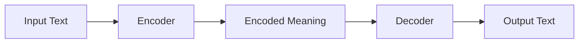
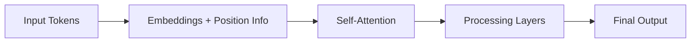
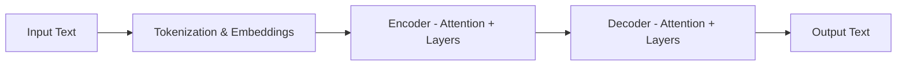

## 02. Transformer-Architecture

<div align="center">
  <table>
    <tr>
      <td align="center"></td>
      <td align="center"></td>
      <td align="center"></td>
      <td align="center"></td>
      <td align="center"></td>
      <td align="center"></td>
    </tr>
  </table>
</div>

## 02.1 What is a Transformer?

---

### <td align="center"> Introduction

Transformers were originally created to solve problems where one sequence of information needs to be turned into another. A classic example is translating text from one language to another. Because they transform an input into an output, they are “Transformers”.

---

### What Are Transformer Models?

A Transformer is a type of artificial intelligence that learns how words relate to each other so it can understand and generate text that feels natural to humans ([NLP](https://github.com/gil-son/language-ai-engineering-lab/blob/main/01-Human-Language-and-NLP/01-1-What-Is-Human-Language.md)).

In simple terms:

A Transformer reads a lot of text, learns patterns in how words are used together, and then uses that knowledge to create new text or understand existing text.

Transformers are the technology behind many modern AI systems, including chatbots and language models. They are an improvement over older approaches because they don’t read text word by word like a human reading a sentence from left to right. Instead, they look at the whole sentence at once.

**So how do they understand meaning without reading step by step?**

They focus on **relationships** between words. For example, they learn which words are important to each other and which ones provide context. This is done using a concept called **attention**, which simply means the model learns where to “pay attention” when trying to understand or generate text.

<div align="center">

<p>Image by the Datacamp</p>
</div>

---

##   Historical Context


Transformers are a relatively recent but very important development in artificial intelligence.

They were first introduced in 2017 by researchers at Google in a paper called “Attention Is All You Need.” This paper described a new way for computers to understand and generate language more effectively.

Soon after, developers began turning this idea into real software, making it possible for others to experiment with and build on it. This helped the idea spread quickly across the AI community.

The impact was immediate. Transformers made it much easier for computers to understand context and meaning in text. Because of this, they became the foundation for many powerful language systems that followed, including models like **BERT**.

By **2020**, Transformers reached the public spotlight with the release of GPT-3 by OpenAI. People around the world started using it to write stories, poems, computer code, websites, and more. For many, this was the first time AI felt creative and conversational.

In **2021**, researchers described these systems as **foundation models**, meaning they are basic building blocks that many other AI applications are built on. Today, Transformers sit at the core of modern AI and have changed how machines understand and work with human language.

---

##   The Transformer Architecture Overview

Transformers were first created to solve tasks where one sequence is turned into another, such as translating text from one language to another.

You can think of a Transformer as a black box that takes a sentence as input and produces another sentence as output.

For example:

<div align="center">

<p>Image by the Datacamp</p>
</div>

### Encoder

The **encoder** reads the input sentence and turns it into an internal representation that captures its meaning.

```
"How are you?"
```
and converts it into a form the model can understand.

### Decoder

The decoder takes this internal representation and uses it to generate the output sentence, one part at a time.
In our example, it generates:

```
"¿Cómo estás?"
```

### How They Work Together

```
Input sentence → Encoder → Decoder → Output sentence
```
- The encoder understands the input.
- The decoder produces the final result.

### Multiple Layers for Better Understanding

In practice, the encoder and decoder are not just single blocks. Each one is made of multiple layers stacked on top of each other.
- All encoder layers have the same structure
- All decoder layers have the same structure
- The output of one layer becomes the input to the next

The original Transformer used 6 encoder layers and 6 decoder layers, but modern models can use more or fewer layers depending on the problem.

You can imagine it like this:

<div align="center">

<p>Image by the Datacamp</p>
</div>

Each layer helps the model understand the input and produce better output.

Now that we have a high-level idea of how Transformers are structured, we can look more closely at **what the encoder and decoder actually do** and how they process information.


---

### <td align="center"> Why use it?
Transformers are widely used because they:
- Scale efficiently with large datasets and model sizes  
- Enable parallel processing of tokens (unlike RNNs)  
- Capture long-term dependencies using self-attention  
- Generalize well across multiple modalities (text, images, audio)  
- Serve as a unified architecture for NLP, vision, and multimodal tasks  

---

## <td align="center"> How it works?

This section explains how a Transformer works using two perspectives:
- a **high-level architectural view** (Encoder → Decoder)
- an **internal view** (what happens inside each part)

### High-Level View (Architecture)

A Transformer is made of three main ideas working together:

- Encoder → understands the input text
- Decoder → generates the output text
- Attention → connects words based on meaning and context

Together, these elements form the **Transformer model**.



---

### Internal View (What Happens Inside Encoder & Decoder)


This is the inside view, which explains how the encoder and decoder work:

1. The input text is broken into smaller pieces called **tokens**  
2. Tokens are converted into numerical representations (**embeddings**) and combined with **positional information**  
3. **Attention** analyzes relationships between all tokens  
4. The results pass through **neural processing layers**  
5. Multiple layers refine the understanding step by step  
6. Final representations are used to generate outputs (for example, the next word)



---

### Where does this happen?

- **Tokenization & Embeddings**  
  → Before and at the start of the **Encoder**

- **Attention & Processing Layers**  
  → Inside each **Encoder and Decoder layer**

- **Final Output Generation**  
  → Performed by the **Decoder**

---

### Putting Everything Together (Complete Mental Model)


---

#### Plain-Language Analogy

Think of a **human translator**:

- **Tokenization & Embeddings**  
  → Reading and recognizing words  

- **Encoder (Attention + Layers)**  
  → Understanding meaning and context  

- **Decoder (Attention + Layers)**  
  → Speaking or writing the translation  

- **Transformer**  
  → The complete translation system

---

### <td align="center"> Real-Life Transformer Models

#### BERT

Google's 2018 release of BERT, an open-source natural language processing framework, revolutionized NLP with its unique bidirectional training, which enables the model to have more context-informed predictions about what the next word should be.

By understanding context from all sides of a word, BERT outperformed previous models in tasks like question-answering and understanding ambiguous language. Its core uses Transformers, connecting each output and input element dynamically.

BERT, pre-trained on Wikipedia, excelled in various NLP tasks, prompting Google to integrate it into its search engine for more natural queries. This innovation sparked a race to develop advanced language models and significantly advanced the field's ability to handle complex language understanding.

#### LaMDA

LaMDA (Language Model for Dialogue Applications) is a Transformer-based model developed by Google, designed specifically for conversational tasks, and launched during the 2021 Google I/O keynote. They are designed to generate more natural and contextually relevant responses, enhancing user interactions in various applications.

LaMDA's design enables it to understand and respond to a wide range of topics and user intents, making it ideal for applications in chatbots, virtual assistants, and other interactive AI systems where a dynamic conversation is key.

This focus on conversational understanding and response marks LaMDA as a significant advancement in the field of natural language processing and AI-driven communication.

### GPT and ChatGPT

GPT and ChatGPT, developed by OpenAI, are advanced generative models known for their ability to produce coherent and contextually relevant text. GPT-1 was its first model launched in June 2018 and GPT-3, one of the most impactful models, was launched two years later in 2020.

These models are adept at a wide range of tasks, including content creation, conversation, language translation, and more. GPT's architecture enables it to generate text that closely resembles human writing, making it useful in applications like creative writing, customer support, and even coding assistance. ChatGPT, a variant optimized for conversational contexts, excels in generating human-like dialogue, enhancing its application in chatbots and virtual assistants.

---

### <td align="center"> Use Cases
Transformers are used in a wide range of applications, such as:
- Machine Translation  
- Text Summarization  
- Question Answering  
- Chatbots and Conversational AI  
- Code Generation  
- Speech Recognition  
- Image Captioning and Vision Transformers  

---

###  Code/Notebook/Projects

- [Build transformer from Scratch](https://github.com/gil-son/language-ai-engineering-lab/tree/main/notebooks/02-Transformers)
- [Building a transformer with Pytorch](https://www.datacamp.com/tutorial/building-a-transformer-with-py-torch)

---

###  Contents
- [DataCamp - How Transformers Work](https://www.datacamp.com/tutorial/how-transformers-work)


---

###  Videos

A few recommended resources to visualize:

<div align="center">
  <a href="https://www.youtube.com/watch?v=ZXiruGOCn9s&pp=ygUVaG93IHRyYW5zZm9ybWVycyB3b3Jr" target="_blank">
      
  </a>
</div>
