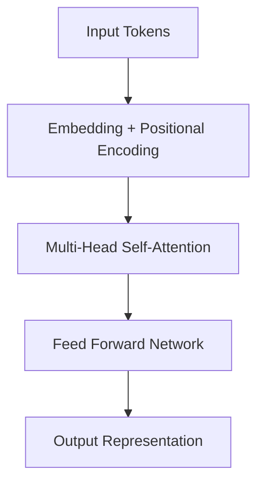

## 02.1. Transformer-Architecture

### <td align="center"> Introduction
Transformers were originally created to solve problems where one sequence of information needs to be turned into another. A classic example is translating text from one language to another. Because they transform an input into an output, they are “Transformers”.

---

### What Are Transformer Models?

A Transformer is a type of artificial intelligence that learns how words relate to each other so it can understand and generate text that feels natural to humans.

In simple terms:

A Transformer reads a lot of text, learns patterns in how words are used together, and then uses that knowledge to create new text or understand existing text.

Transformers are the technology behind many modern AI systems, including chatbots and language models. They are an improvement over older approaches because they don’t read text word by word like a human reading a sentence from left to right. Instead, they look at the whole sentence at once.

**So how do they understand meaning without reading step by step?**

They focus on **relationships** between words. For example, they learn which words are important to each other and which ones provide context. This is done using a concept called **attention**, which simply means the model learns where to “pay attention” when trying to understand or generate text.

---

### <td align="center"> Why use it?
Transformers are widely used because they:
- Scale efficiently with large datasets and model sizes  
- Enable parallel processing of tokens (unlike RNNs)  
- Capture long-term dependencies using self-attention  
- Generalize well across multiple modalities (text, images, audio)  
- Serve as a unified architecture for NLP, vision, and multimodal tasks  

---

### <td align="center"> How it works?

The Transformer processes input sequences using attention mechanisms that allow each token to attend to all others in the sequence, learning contextual relationships directly.

#### Step-by-step Process
1. Tokens are converted into embeddings and combined with positional encodings  
2. Self-attention computes relationships between all tokens  
3. Attention outputs are passed through feed-forward neural networks  
4. Layers are stacked to form deep representations  
5. Final representations are projected to outputs (e.g., next-token probabilities)

#### Simple Diagram

---

### <td align="center"> Components
Key components of the Transformer architecture include:
- Token Embeddings  
- Positional Encoding  
- Multi-Head Self-Attention  
- Scaled Dot-Product Attention  
- Feed-Forward Neural Networks  
- Residual Connections  
- Layer Normalization  
- Encoder and Decoder Blocks  

---

### <td align="center"> Use Cases
Transformers are used in a wide range of applications, such as:
- Machine Translation  
- Text Summarization  
- Question Answering  
- Chatbots and Conversational AI  
- Code Generation  
- Speech Recognition  
- Image Captioning and Vision Transformers  

---

###  Code/Notebook/Projects

- [Build transformer from Scratch](https://github.com/gil-son/language-ai-engineering-lab/tree/main/notebooks/02-Transformers)

---

###  Videos
