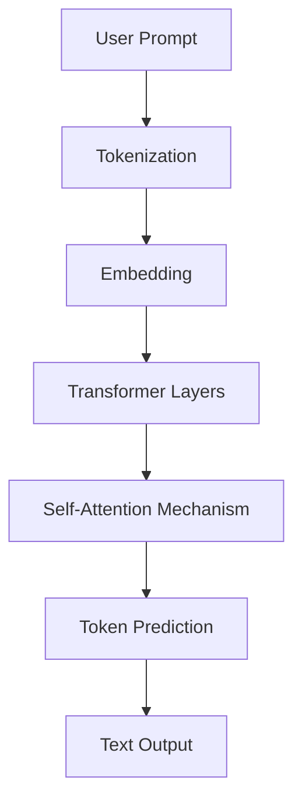

# 01. Fundamentals

  <table>
    <tr>
      <td align="center"></td>
      <td align="center"></td>
    </tr>
  </table>

 

---

  <table>
    <tr>
      <td align="center"></td>
      <td align="center"></td>
      <td align="center"></td>
      <td align="center"></td>
      <td align="center"></td>
      <td align="center"></td>
      <td align="center"></td>
    </tr>
  </table>

 

## 01.1. What is an LLM?

### <td align="center"> Introduction

---

A **Large Language Model (LLM)** is an advanced machine learning model trained on vast amounts of text data to understand, generate, and interact using human language.  
These models are based on the **Transformer architecture** and can perform a wide variety of Natural Language Processing (NLP) tasks, such as:

- Answering questions  
- Writing and debugging code  
- Translating languages  
- Summarizing text  
- Reasoning and problem-solving  

LLMs are at the core of modern AI applications like **ChatGPT, Claude, and Google Gemini**, and are transforming how businesses, developers, and users interact with machines.

**Core idea:**  
> Instead of processing words sequentially (like RNNs), transformers look at *all words at once* to understand contextual relationships.

---

### <td align="center"> Why use it?
  
#### LLMs help address a range of language-related challenges:

- **Language Understanding**: Enables machines to comprehend and interpret natural language.
- **Text Generation**: Automates content creation across a wide variety of formats.
- **Question Answering**: Powers intelligent search and conversational interfaces.
- **Translation and Summarization**: Improves access to global information and compresses long content.
- **Code Assistance**: Supports software development by writing or explaining code.

#### Key advantages of using LLMs include:

- **High Versatility**: One model can perform dozens of NLP tasks with minimal tuning.
- **Zero/Few-shot Learning**: LLMs can complete new tasks by simply providing examples in a prompt.
- **Productivity Boost**: Speeds up writing, coding, and content generation.
- **Multilingual Capabilities**: Many LLMs understand and generate text in multiple languages.
- **Human-like Interaction**: Enables more natural communication with machines.

---

### <td align="center"> Components

#### Frontier LLMs

Frontier LLMs represent the most advanced language models available — either closed-source or open-source — optimized for reasoning, efficiency, and multimodal capabilities.

- **Closed-Source**
   - **GPT (OpenAI)** – Industry leader in general-purpose reasoning, coding, and conversation. Known for ChatGPT.  
   - **Claude (Anthropic)** – Emphasizes safety and constitutional AI. Strong at long-context understanding.  
   - **Gemini (Google DeepMind)** – Integrates with Google’s ecosystem; strong at multimodal reasoning (text, images, code).  
   - **Command R (Cohere)** – Optimized for retrieval-augmented generation [(RAG)](https://github.com/gil-son/llm-engineering-lab/tree/main/03-RAG-Pipeline) and enterprise workflows.  
   - **Perplexity** – Hybrid model + search engine; optimized for real-time question answering with citations.  

- **Open-Source**
   - **LLaMA (Meta)** – A family of open models widely adapted for fine-tuning and research.  
   - **Mixtral (Mistral)** – Sparse Mixture-of-Experts (MoE) architecture, offering efficiency with strong performance.  
   - **Qwen (Alibaba Cloud)** – Open models with strong multilingual support, especially for Asian languages.  
   - **Gemma (Google)** – Lightweight models released for research and local development.  
   - **Phi (Microsoft)** – Small, efficient models optimized for reasoning with surprisingly strong results.  

#### Capabilities of Frontier Models

- **Synthesizing information** – Produces structured, researched, and summarized answers.  
- **Expanding ideas** – Turns notes into polished drafts (emails, reports, blog posts).  
- **Coding** – Writes, debugs, and explains code; has become a go-to tool for developers.  
- **Multimodality** – Some models understand text, images, and even audio/video.  
- **Long-context reasoning** – Models like Claude and GPT-4 Turbo handle 100k+ tokens.  

---

### <td align="center"> How it works?

LLMs are typically based on the **Transformer architecture**. They are trained on massive text datasets to learn statistical patterns of language. Once trained, they use attention mechanisms to generate context-aware responses based on the user’s prompt.  

They can also be enhanced via **prompt engineering**, **retrieval-augmented generation (RAG)**, or **agent-based systems** to perform complex reasoning and integrate external knowledge.

#### Step-by-step Process

1. **Input (Prompt)** – You provide a question, sentence, or instruction to the model.  
   _Example_: "Explain what a transformer model is."  
2. **Tokenization** – The input text is broken down into tokens (words, subwords, or characters) and converted into numerical IDs.  
3. **Embedding** – The tokens are represented as vectors in a high-dimensional space.  
4. **Transformer Layers (Attention Mechanism)** – The model applies **self-attention** to relate words and context dynamically.  
5. **Prediction (Decoding)** – The next token(s) are predicted iteratively until a complete response is formed.  
6. **Output (Text)** – The predicted tokens are converted back into readable text.

#### Simple Diagram

---

### <td align="center"> Use Cases

#### Ways to Use LLMs

LLMs can be integrated across platforms and workflows depending on the level of control, cost, and performance needed.

1. **Chat Interfaces** – Direct use via apps like **ChatGPT**, **Claude.ai**, or **Gemini**.  
2. **Cloud APIs** – Access through REST/GraphQL APIs (OpenAI, Anthropic, Cohere).  
   - Frameworks: **LangChain**, **Semantic Kernel**  
   - Managed platforms: **Amazon Bedrock**, **Azure ML**, **Vertex AI**  
3. **Direct Inference** – Run local models via **Hugging Face**, **Ollama**, or **LM Studio** for privacy and control.

#### Popular Applications

- **Chatbots & Virtual Assistants** – Automate support and enhance user interactions.  
- **Content Generation** – Produce marketing, documentation, or educational material.  
- **Code Generation** – Write, refactor, and document code.  
- **Semantic Search** – Retrieve relevant info using embeddings.  
- **Legal & Financial Analysis** – Summarize and extract insights from complex texts.  
- **Healthcare** – Summarize medical notes or assist diagnosis documentation.

---

###  Limitations

Despite their power, LLMs have important limitations:

- **Specialized Knowledge** – Below human experts in niche domains.  
- **Knowledge Cut-off** – Awareness limited by training data date.  
- **Hallucinations** – May generate factually incorrect information.  
- **Cost** – API usage at scale can be expensive.  
- **Data Privacy** – Sending sensitive data to external APIs can pose security risks.

---

###  Code/Notebook/Projects

- [Connect with an LLM using LangChain](https://github.com/gil-son/llm-engineering-lab/tree/main/projects/04-langchain)
- [Create an LLM from scratch](https://github.com/gil-son/llm-engineering-lab/tree/main/notebooks/01-transformer-lm)

---

###  Videos

A few recommended resources to visualize how LLMs work:

  

  

