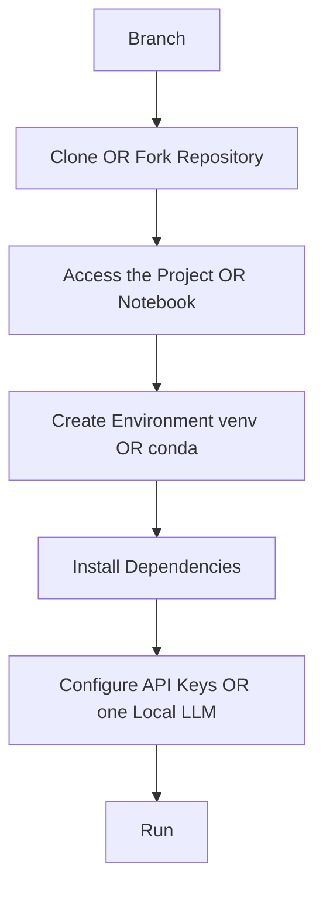

# 01. Fundamentals

<div align="center">
  <table>
    <tr>
      <td align="center"></td>
      <td align="center"></td>
      <td align="center"></td>
      <td align="center"></td>
    </tr>
  </table>
</div>

<br/>

## 01.3. Environments Setup

### <td align="center"> Introduction

---

Before diving into model architectures and fine-tuning, it’s crucial to configure a reliable environment for working with Large Language Models (LLMs).

This setup ensures:

Reproducibility — everyone can run the same code under the same conditions.

Dependency management — models, frameworks, and libraries evolve rapidly.

Hardware optimization — environments differ depending on CPU, GPU, or cloud usage.

In this section, you’ll learn how to create and manage your Python environments using both venv and conda, install essential libraries, and connect to APIs like OpenAI or Hugging Face.

---

### <td align="center"> Why use it?
  
Setting up environments properly prevents the infamous “it works on my machine” problem.

For LLM projects, this is especially important because:

You’ll often switch between different frameworks (LangChain, LlamaIndex, Transformers, etc.).

You may work on GPU-enabled setups locally or in the cloud.

Environment reproducibility is key for collaboration and deployment.

---

### <td align="center"> Components

| Component              | Description                                          | Example                         |
| ---------------------- | ---------------------------------------------------- | ------------------------------- |
| **Python Environment** | Isolated workspace with specific dependencies        | `venv` or `conda`               |
| **Requirements File**  | Lists all Python dependencies                        | `requirements.txt`              |
| **Environment YAML**   | Conda-based specification of libraries and versions  | `environment.yml`               |
| **API Keys**           | Credentials to connect to OpenAI, Hugging Face, etc. | `.env` or environment variables |
| **Version Control**    | Ensures team reproducibility                         | `git`, `.gitignore`             |

---

### <td align="center"> How it works?

Each project can have its own virtual environment.
When activated, Python uses its local libraries, isolated from global installations.

Step-by-step Process

1. Clone the repository:
```
git clone https://github.com/gil-son/llm-engineering-lab.git
cd llm-engineering-lab
```
2. Access the desired notebook or project:
```
cd notebooks/03-RAG
```

OR

```
cd projects/04-langchain
```

3. Choose your environment manager conform the project OR notebook:

- Option 1: Using venv
```
python3 -m venv venv
source venv/bin/activate   # Linux/macOS
venv\Scripts\activate      # Windows
pip install -r requirements.txt
```
- Option 2: Using conda
```
conda env create -f environment.yml
conda activate <project-name-inside-of-environment>
jupyter lab
```
4. Configure API keys

Option 1:Create a .env file in your root directory:
```
OPENAI_API_KEY=your_openai_key
HUGGINGFACEHUB_API_TOKEN=your_hf_token
```

<details>
  <summary>Option 2: Install a local LLM runtime, such as Ollama</summary>

  --- 
  
  Ollama is a free Large Language Model (LLM) with reduced capacity
compared to commercial models, but it works very well for **practice,
studies, and prototypes**.

It can be installed on: 
- Personal computers
- Servers
- On-premise environments

--- 

#### 1. Ollama Download

Access the official download page:
https://ollama.com/download

--- 

#### 2. Installation by Operating System

##### Linux

Run the following command in the terminal:

``` bash
curl -fsSL https://ollama.com/install.sh | sh
```

##### Windows or macOS

Download the installer directly from the official website and follow the
installation steps.

--- 

#### 3. Choosing a Model (LLM)

After installation, browse the model library to select the version that
best fits your use case (text, code, multimodal, etc.):
https://ollama.com/library

When choosing a model, consider: - Model size (1B, 3B, 7B, etc.) - Task
type (text generation, chat, code, etc.) - Hardware and resource usage

--- 

#### 4. Downloading the Model (Pull)

Once you have selected a model, download it using the `pull` command.

Example: using **llama 3.2**, a moderate model with options ranging from
**1B to 3B** parameters:

``` bash
ollama pull llama3.2
```

--- 

#### 5. Running the Model

After downloading the model, run it with:

``` bash
ollama run llama3.2
```

---

#### 6. Important Notes

-   Always ensure the Ollama service is running before using it in a
    project
    
-   In some systems, Ollama may start automatically when the computer
    boots
    
--- 

#### 7. Project Dependencies

In your project dependency file (`requirements.txt`, `environment.yml`,
etc.), include the required library to integrate with Ollama.

**For example**, If your project uses **LangChain** and consumes the locally installed
Ollama, add the following dependency:

``` txt
langchain-ollama
```

--- 

#### 8. Select Your Model

When configuring your project, import the required libraries and specify the model name:

```python
model_name = "llama3.2"
```

</details>


#### Simple Diagram




---

### <td align="center"> Use Cases

- Running local experiments with small or open models (e.g., GPT-2, Mistral-7B, Llama 3 via Ollama)
- Building reproducible demos with LangChain or LlamaIndex
- Hosting notebooks on VSCode, Jupyter, or Colab
- Preparing isolated development environments for RAG, fine-tuning, or evaluation pipelines

---

###  Limitations

- Virtual environments do not include GPU drivers or CUDA setup — these must be installed separately.
- Environment activation commands vary by operating system (Windows, macOS, Linux).
- API keys must be stored securely — **never commit** .env files or secrets to version control.

---

###  Code/Notebook/Projects

- [requirements.txt](https://github.com/gil-son/llm-engineering-lab/blob/main/projects/04-langchain/basic-openai-connection-with-langserve-and-client/requirements.txt): this is an example file with necessaries labaries to be installed via venv
- [environment.yml](https://github.com/gil-son/llm-engineering-lab/blob/main/notebooks/03-RAG/environment.yml): this is an example file with necessaries labaries to be installed via conda (anaconda)

---

###  Videos

A few recommended resources to visualize how environments and reproducibility work:

Create and activate environment with **venv** and manage it:
<div align="center">
  <a href="https://www.youtube.com/watch?v=Y21OR1OPC9A" target="_blank">
      
  </a>
</div>
<hr/>

Create environment with **conda** and manage it:
<div align="center">
  <a href="https://www.youtube.com/shorts/EvkK3VhCloQ" target="_blank">
      
  </a>
</div>
