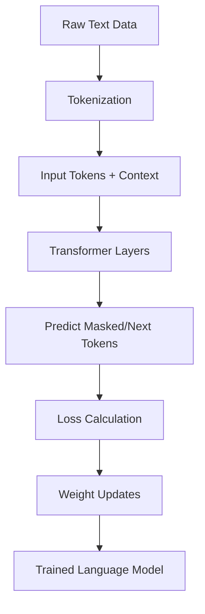

# 01. Fundamentals

  <table>
    <tr>
      <td align="center"></td>
      <td align="center"></td>
    </tr>
  </table>

 

---

  <table>
    <tr>
      <td align="center"></td>
      <td align="center"></td>
      <td align="center"></td>
      <td align="center"></td>
      <td align="center"></td>
      <td align="center"></td>
      <td align="center"></td>
    </tr>
  </table>

 

## 01.5. Pretraining and Objectives

### <td align="center"> Introduction

---

Pretraining is the **foundation phase** in building a Large Language Model (LLM).  
During this stage, a model learns **general language patterns, grammar, facts, and reasoning** from large-scale text corpora — typically scraped from the internet, books, code, and articles.

The model learns through **self-supervised learning**, predicting hidden or next words in text sequences.  
This gives it a strong base to later specialize (fine-tuning, instruction-tuning, RLHF).

---

### <td align="center"> Why use it?
  
- Builds **language understanding** without labeled data.  
- Enables the model to learn **syntax, semantics, and context**.  
- Reduces the need for task-specific data later (fine-tuning).  
- Provides **transferable knowledge** that can be adapted to many NLP tasks.  
- Forms the **backbone of generalization** for LLMs like GPT, LLaMA, and PaLM.

---

### <td align="center"> Components

1. **Massive Text Corpus** – The raw data source for training (Wikipedia, web crawl, books, code).  
2. **Tokenizer** – Converts text into subword tokens.  
3. **Model Architecture** – Typically a transformer with encoder-decoder or decoder-only design.  
4. **Objective Function** – Defines how the model learns from text (e.g., Masked LM, Causal LM).  
5. **Optimization Process** – Gradually adjusts weights to minimize prediction loss.  
6. **Compute Infrastructure** – High-performance GPUs/TPUs for distributed training.

---

### <td align="center"> How it works?

Pretraining teaches the model to predict or reconstruct text — enabling it to develop statistical and semantic understanding of language.

#### Common Pretraining Objectives

- **Masked Language Modeling (MLM)** – Used in *BERT*: mask some words and predict them.  
- **Causal Language Modeling (CLM)** – Used in *GPT*: predict the next token given previous ones.  
- **Seq2Seq (Denoising Autoencoding)** – Used in *T5*: reconstruct corrupted text sequences.  
- **Span Prediction / Permutation LM** – Used in *XLNet*: predict random token spans or permutations.  

#### Step-by-step Process

1. **Collect Text Data** (massive corpus).  
2. **Tokenize Text** into subword pieces.  
3. **Feed Sequences** into the model.  
4. **Predict Missing or Next Tokens.**  
5. **Compute Loss (Cross-Entropy).**  
6. **Backpropagate to Update Weights.**  
7. **Repeat for Billions of Steps.**

#### Simple Diagram

---

### <td align="center"> Use Cases

- Foundation for all downstream fine-tuning and instruction tasks.  
- Enables **zero-shot** and **few-shot** reasoning.  
- Used to build:  
  - **General-purpose chatbots (GPT, Claude)**  
  - **Multilingual models (BLOOM)**  
  - **Code models (Codex, StarCoder)**  
  - **Scientific or domain models (BioBERT, MedPaLM)**  

---

###  Limitations

- **Extremely costly** (data + compute).  
- **Data bias** can lead to biased outputs.  
- **No explicit reasoning** — learns statistical associations.  
- **Hard to interpret** internal representations.  
- **Catastrophic forgetting** during fine-tuning if not careful.

---

###  Code/Notebook/Projects

- [Create an LLM from scratch](https://github.com/gil-son/language-ai-engineering-lab/tree/main/notebooks/02-Transformers)

---

###  Video

A recommended video to visualize:

  

