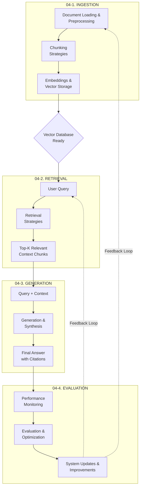

# Retrieval-Augmented Generation (RAG) Pipeline COMPREHENSION SUMMARY

This document outlines the sequential steps and core components of a production-grade Retrieval-Augmented Generation (RAG) system, covering everything from initial data ingestion to final output and continuous feedback.

##   Overview

Retrieval-Augmented Generation (RAG) is an architecture designed to enhance Large Language Models (LLMs) by grounding their answers in external, factual, and up-to-date data sources. Instead of relying solely on the LLM’s internal parameters, RAG injects relevant **context** retrieved from a knowledge base—making responses more accurate, auditable, and domain-specific.

A complete, production-grade RAG pipeline follows a four-stage lifecycle:
---

###  4.1. Ingest Documents (Build the Knowledge Base)

This initial phase focuses on acquiring, preparing, and indexing the external data that the LLM will use to ground its answers, effectively creating the specialized knowledge base.

| Step | Description |
| :--- | :--- |
| **Document Loading / Indexing** | The process of gathering raw, unstructured, and structured data from various sources—including local files, external APIs, web scraping, databases, and cloud storage (S3, GCS)—to begin the RAG pipeline. |
| **Preprocessing** | Cleaning and normalizing the raw text through steps like removing noise, performing OCR on scanned documents, language detection, deduplication, and **metadata extraction** (Author, Date, Source, Tags). This is crucial for maximizing data quality before vectorization. |
| **Chunking** | Dividing large documents into smaller, manageable, and semantically coherent text units (chunks). Strategies range from fixed-size and overlapping splits to advanced methods like **Parent-Child** or semantic-adaptive techniques to optimize the retrieved context. |
| **Embedding** | The crucial step of converting the processed text chunks into high-dimensional numerical vectors using a specialized embedding model. These vectors capture the semantic meaning of the text for fast similarity search. |
| **Vector Store / Vector Database** | The specialized storage layer designed to efficiently store and manage the vector embeddings and their associated metadata. It uses advanced indexing algorithms (like HNSW, IVF) and similarity metrics (Cosine Similarity) to enable high-speed retrieval of relevant context. |

---

###  4.2. Retrivial (At Query Time)

This phase executes the "R" in RAG. It involves transforming the user's question into a searchable format and efficiently fetching the most relevant documents from the Vector Store.

| Step | Description |
| :--- | :--- |
| **Query Processing** | Converting the incoming user query into a vector representation using the exact same embedding model used during the ingestion phase, ensuring the query and document vectors exist in the same semantic space. Also includes query transformation techniques such as decomposition (breaking complex queries into sub-questions), rewriting (reformulating for clarity), and expansion (adding related terms) to improve retrieval accuracy.|
| **Search Techniques** | The mechanism responsible for searching the Vector Store using multiple strategies: semantic search (comparing query vector to stored vectors via similarity metrics), hybrid search (combining vector similarity with traditional keyword/BM25 search for robustness), metadata/filtered retrieval (narrowing results by tags, dates, sources, or other attributes), and multi-query retrieval (generating and executing multiple query variations to capture diverse relevant content). |
| **Ranking & Refinement** | A post-retrieval process that takes the initial set of retrieved chunks and re-scores or filters them using methods like **cross-encoder re-ranking models** or context refinement logic, ensuring only the most relevant and high-quality context is passed to the LLM. |

---

###  4.3. Generation (Answer Composition)

This phase executes the "G" in RAG. It involves synthesizing the final answer by feeding the LLM with the original query and the newly retrieved, refined context.

| Step | Description |
| :--- | :--- |
| **Context Injection** | The process of dynamically constructing the final prompt by interleaving the user's question with the highly-ranked retrieved context chunks, instructing the LLM to answer *only* based on the provided information. |
| **LLM Generation** | The core generative step where the LLM processes the injected context and the user query to produce a fluent and accurate response. **Prompt Engineering** is vital here (System Prompt, Few-shot Examples) to enforce format, tone, and groundedness. |
| **Post-Processing** | Final steps applied to the LLM's output, including summarization, reformatting, providing **source citation/attribution**, and potentially adding a **confidence score** or a reasoning trace for transparency and user trust. |

---

###  4.4.Continuous Improvement

This final, cyclical phase ensures the RAG system remains accurate, relevant, and robust over time by continuously monitoring performance and updating components.

| Step | Description |
| :--- | :--- |
| **Evaluation (Feedback Loop)** | The iterative process of monitoring the system's performance through comprehensive metrics: evaluating retrieval quality (precision, recall, MRR, NDCG, hit rate), assessing generation quality (answer relevance, faithfulness to sources, completeness, hallucination detection), tracking end-to-end metrics (user satisfaction, latency, cost, query success rate), and implementing continuous improvement strategies (applying user feedback to retrain models, updating or expanding the index with new documents or embeddings, caching frequent queries for performance, conducting A/B testing of different retrieval or generation strategies, and fine-tuning components based on real-world usage patterns). |



---

##  RAG-Structure

Overall Structure (RAG → INGEST → RETRIEVAL → GENERATION → FEEDBACK)

The four-stage sequence (Ingestion, Retrieval, Generation, Feedback) is the canonical and most accurate way to describe the RAG architecture. It is perfect.

```
04-RAG-Pipeline/
│
├── README.md                                       # RAG overview, when to use, architecture diagram
│
├── 04-1-Ingestion/                                 # Build the Knowledge Base
│   │
│   ├── 04-1-1-Document-Loading-and-Preprocessing.md
│   │     ├── Document Loading & Indexing
│   │     │     • Local files (PDF, TXT, DOCX, CSV, Markdown)
│   │     │     • APIs (external structured/unstructured data)
│   │     │     • Web scraping (HTML, blogs, news)
│   │     │     • Databases (SQL, NoSQL)
│   │     │     • Cloud storage (S3, Blob, Google Drive, GCS)
│   │     │
│   │     └── Preprocessing
│   │           • Text cleaning (remove noise, symbols)
│   │           • OCR for scanned files
│   │           • Language detection
│   │           • Deduplication
│   │           • Metadata extraction (author, date, source, tags)
│   │
│   ├── 04-1-2-Chunking-Strategies.md
│   │     ├── Fixed-size chunks (500-1000 tokens)
│   │     ├── Overlapping chunks (preserve context)
│   │     ├── Semantic/adaptive chunking
│   │     └── Advanced: Parent-Child, Summary/Metadata
│   │
│   └── 04-1-3-Embeddings-and-Vector-Storage.md
│         ├── Embedding Generation
│         │     • Embedding models (OpenAI, HuggingFace, Cohere)
│         │     • Converting chunks to vectors
│         │     • Storing with metadata
│         │
│         └── Vector Databases
│               ├── Purpose & Core Features
│               │     • Fast similarity search
│               │     • Indexing (HNSW, IVF, PQ)
│               │     • Metadata filtering
│               │     • Upserts and persistence
│               │
│               ├── Similarity Metrics
│               │     • Cosine similarity
│               │     • Dot product
│               │     • Euclidean distance
│               │
│               └── Popular Options
│                     • Chroma (lightweight, open-source)
│                     • FAISS (local, Facebook AI)
│                     • Pinecone (managed cloud)
│                     • Weaviate (hybrid search)
│                     • Qdrant (production-grade)
│                     • Milvus (scalable, enterprise)
│
├── 04-2-Retrieval/                                 # Query-Time Operations
│   │
│   └── 04-2-1-Retrieval-Strategies.md
│         ├── Query Processing
│         │     • Query embedding
│         │     • Query transformation (decomposition, rewriting)
│         │     • Query expansion
│         │
│         ├── Search Techniques
│         │     • Semantic search (vector similarity)
│         │     • Hybrid search (keyword + vector)
│         │     • Metadata/filtered retrieval
│         │     • Multi-query retrieval
│         │
│         └── Ranking and Refinement
│               • Re-ranking (cross-encoder, BM25 hybrid)
│               • Relevance scoring
│               • Context refinement (remove redundant text)
│               • Top-K selection strategies
│
├── 04-3-Generation/                                # Answer Composition
│   │
│   └── 04-3-1-Generation-and-Synthesis.md
│         ├── Context Injection
│         │     • Combining retrieved documents
│         │     • Context window management
│         │     • Document ordering strategies
│         │
│         ├── LLM Generation
│         │     • Prompt engineering (system prompts, few-shot)
│         │     • Grounding in retrieved context
│         │     • Temperature and sampling strategies
│         │     • Handling long contexts
│         │
│         └── Post-Processing
│               • Summarization and reformatting
│               • Source citation and attribution
│               • Confidence scoring
│               • Chain-of-thought reasoning traces
│
└── 04-4-Evaluation/                                # Continuous Improvement
    │
    └── 04-4-1-Evaluation-and-Optimization.md
          ├── Retrieval Evaluation
          │     • Precision, recall, F1
          │     • Mean Reciprocal Rank (MRR)
          │     • Normalized Discounted Cumulative Gain (NDCG)
          │     • Hit rate and coverage
          │
          ├── Generation Evaluation
          │     • Answer relevance
          │     • Faithfulness to sources
          │     • Completeness
          │     • Hallucination detection
          │
          ├── End-to-End Metrics
          │     • User satisfaction
          │     • Latency and cost
          │     • Query success rate
          │
          └── Continuous Improvement
                • Feedback loops
                • Index updates (new documents/embeddings)
                • Query caching
                • A/B testing
                • Fine-tuning based on feedback
```

